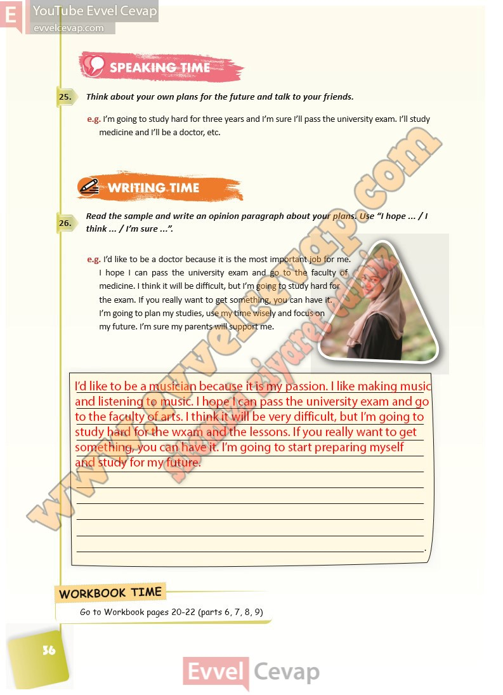

## 10. Sınıf İngilizce Ders Kitabı Cevapları Pasifik Yayınları Sayfa 36

**Soru: Think about your own plans for the future and talk to your friends.**

**Soru: Read the sample and write an opinion paragraph about your plans. Use “I hope … / I think … / I’m sure …”.**

**10. Sınıf Pasifik Yayınları İngilizce Ders Kitabı Sayfa 36**