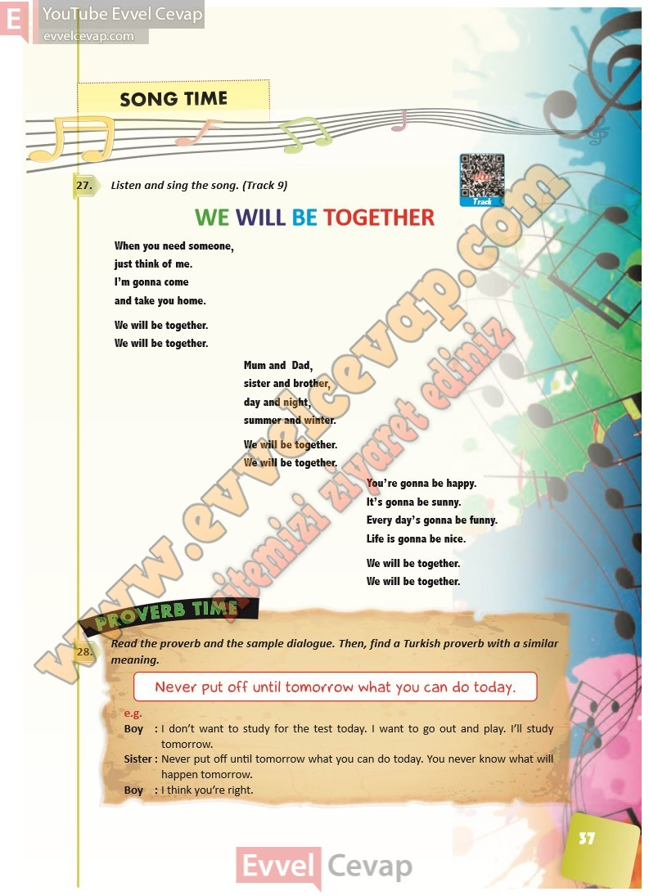

## 10. Sınıf İngilizce Ders Kitabı Cevapları Pasifik Yayınları Sayfa 37

**Soru: Listen and sing the song. (Track 9)**

When you need someone,  
 just think of me.  
 I’m gonna come  
 and take you home.  
 We will be together.  
 We will be together.

Mum and Dad,  
 sister and brother,  
 day and night,  
 summer and winter.  
 We will be together.  
 We will be together.

You’re gonna be happy.  
 It’s gonna be sunny.  
 Every day’s gonna be funny.  
 Life is gonna be nice.  
 We will be together.  
 We will be together.

**Soru: Read the proverb and the sample dialogue. Then, find a T urkish proverb with a similar meaning.**

**10. Sınıf Pasifik Yayınları İngilizce Ders Kitabı Sayfa 37**