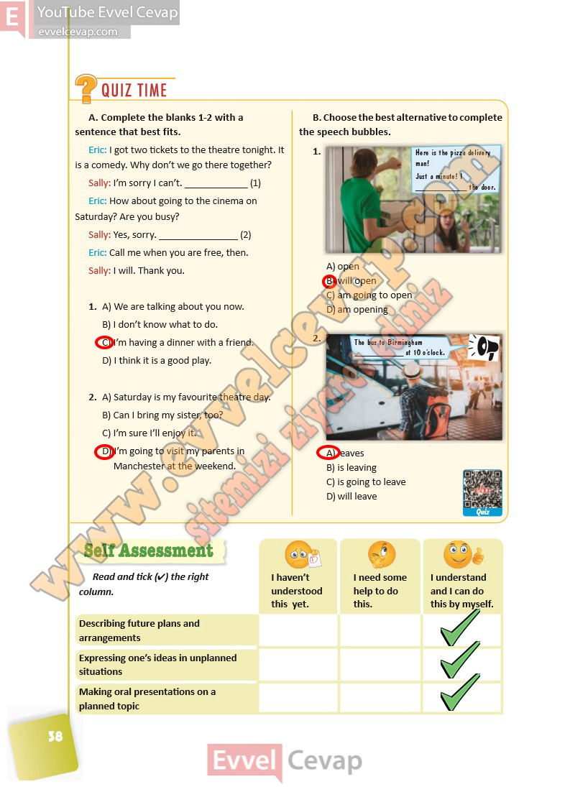

## 10. Sınıf İngilizce Ders Kitabı Cevapları Pasifik Yayınları Sayfa 38

**Soru: Complete the blanks 1-2 with a sentence that best fits.**

**Soru: Choose the best alternative to complete the speech bubbles.**

**Soru: Read and tick (4) the right** **column.**

**10. Sınıf Pasifik Yayınları İngilizce Ders Kitabı Sayfa 38**