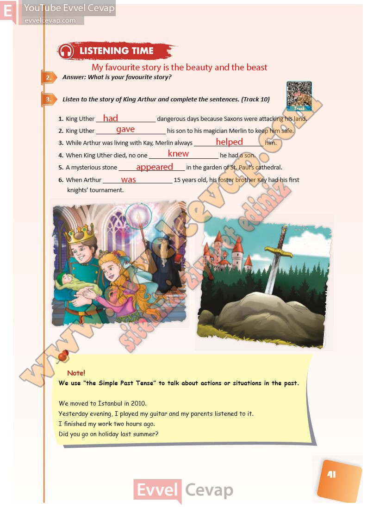

## 10. Sınıf İngilizce Ders Kitabı Cevapları Pasifik Yayınları Sayfa 41

**Soru: Answer: What is your favourite story?**

**Soru: Listen to the story of King Arthur and complete the sentences. (Track 10)**

**Soru: We use “the Simple Past Tense” to talk about actions or situations in the past.**

**10. Sınıf Pasifik Yayınları İngilizce Ders Kitabı Sayfa 41**