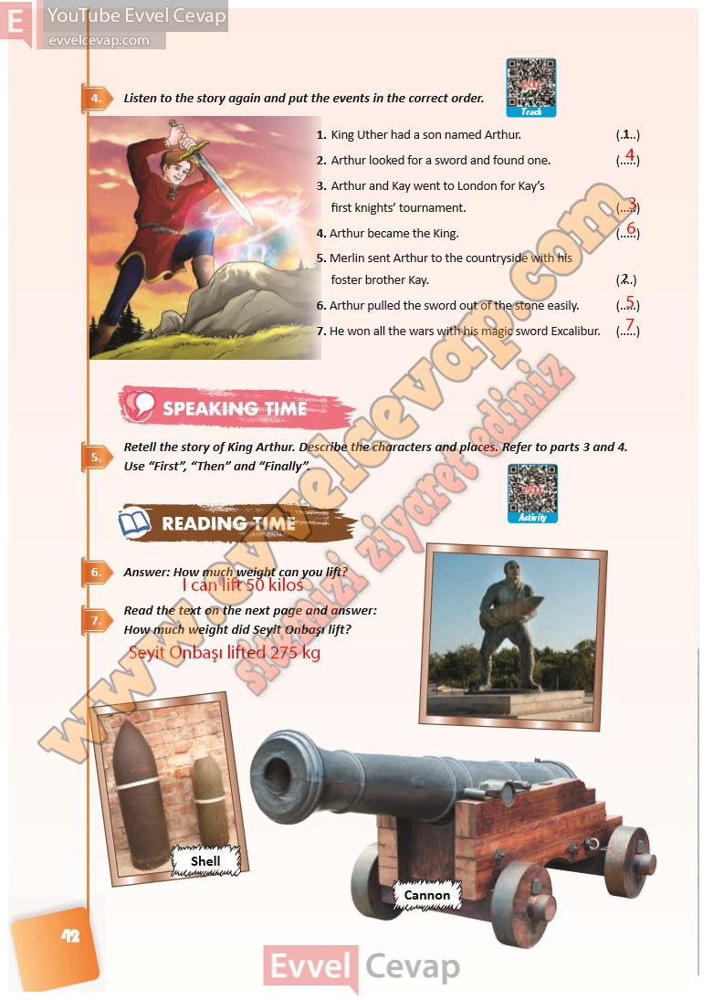

## 10. Sınıf İngilizce Ders Kitabı Cevapları Pasifik Yayınları Sayfa 42

**Soru: Listen to the story again and put the events in the correct order.**

**Soru: Retell the story of King Arthur. Describe the characters and places. Refer to parts 3 and 4. Use “First”, “Then” and “Finally”.**

**Soru: Answer: How much weight can you lift?**

**Soru: Read the text on the next page and answer: How much weight did Seyit Onbaşı lift?**

**10. Sınıf Pasifik Yayınları İngilizce Ders Kitabı Sayfa 42**