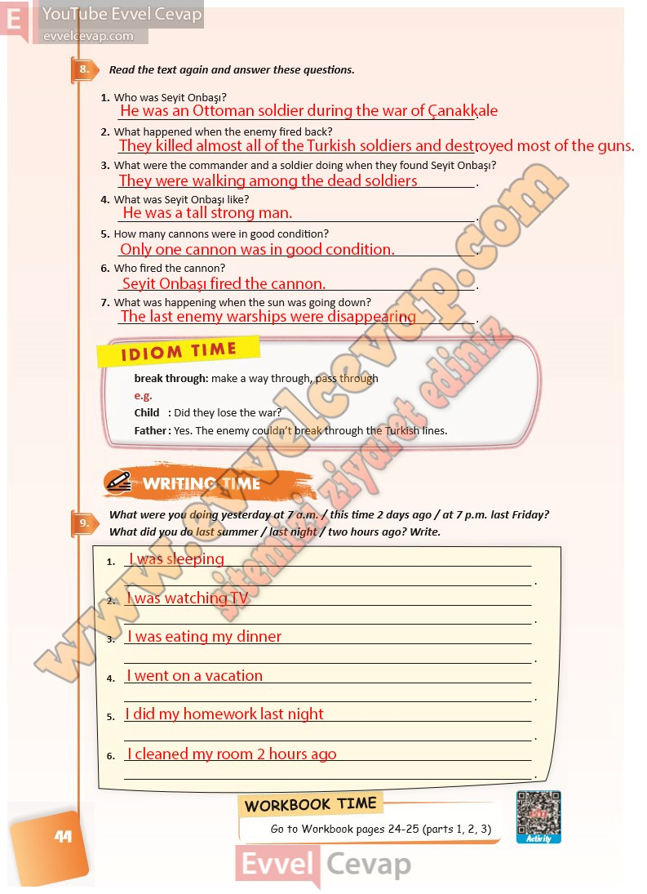

## 10. Sınıf İngilizce Ders Kitabı Cevapları Pasifik Yayınları Sayfa 44

**Soru: Read the text again and answer these questions.**

**Soru: Who was Seyit Onbaşı?**

**Soru: What happened when the enemy fired back?**

**Soru: What were the commander and a soldier doing when they found Seyit Onbaşı?**

**Soru: What was Seyit Onbaşı like?**

**Soru: How many cannons were in good condition?**

**Soru: Who fired the cannon?**

**Soru: What was happening when the sun was going down?**

**Soru: What were you doing yesterday at 7 a.m. / this time 2 days ago / at 7 p.m. las t Friday? What did you do last summer / last night / two hours ago? Write.**

**10. Sınıf Pasifik Yayınları İngilizce Ders Kitabı Sayfa 44**