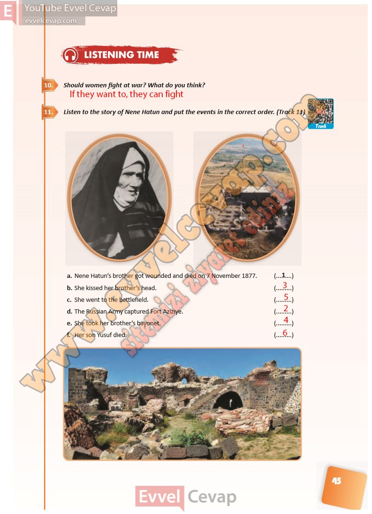

## 10. Sınıf İngilizce Ders Kitabı Cevapları Pasifik Yayınları Sayfa 45

**Soru: Should women fight at war? What do you think?**

**Soru: Listen to the story of Nene Hatun and put the events in the correct order. (Track 11)**

a. Nene Hatun’s brother got wounded and died on 7 November 1877.  
 b. She kissed her brother’s head.  
 c. She went to the battlefield.  
 d. The Russian Army captured Fort Aziziye.  
 e. She took her brother’s bayonet.  
 f. Her son Yusuf died.

**10. Sınıf Pasifik Yayınları İngilizce Ders Kitabı Sayfa 45**