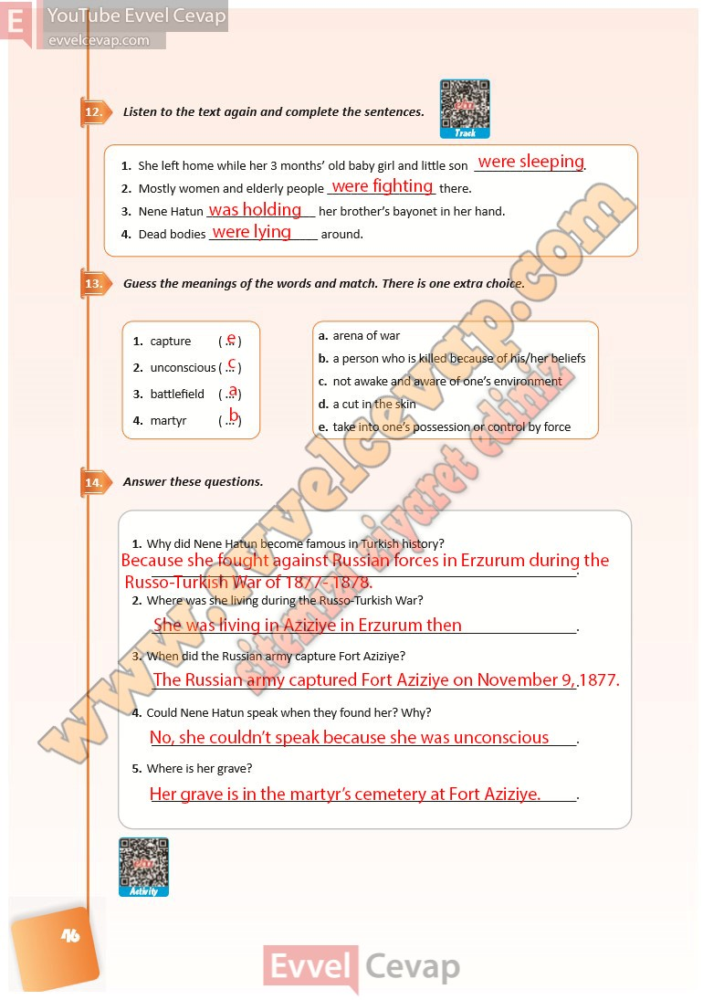

## 10. Sınıf İngilizce Ders Kitabı Cevapları Pasifik Yayınları Sayfa 46

**Soru: Listen to the text again and complete the sentences.**

**Soru: Guess the meanings of the words and match. There is one extra choice.**

**Soru: Answer these questions.**

**Soru: Why did Nene Hatun become famous in Turkish history?**

**Soru: Where was she living during the Russo-Turkish War?**

**Soru: When did the Russian army capture Fort Aziziye?**

**Soru: Could Nene Hatun speak when they found her? Why?**

**Soru: Where is her grave?**

**10. Sınıf Pasifik Yayınları İngilizce Ders Kitabı Sayfa 46**