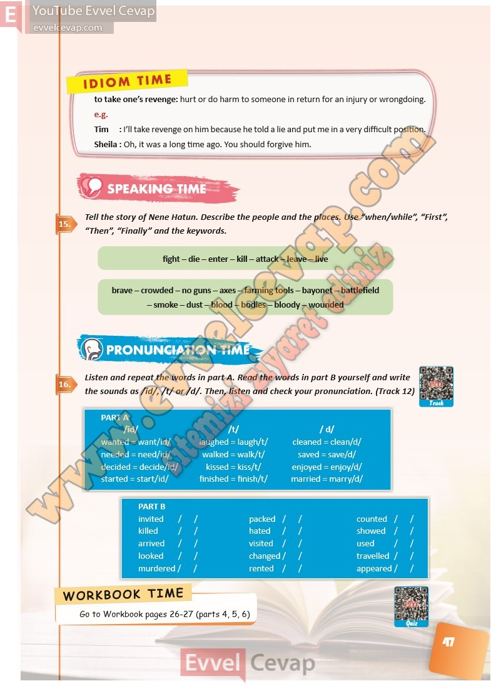

## 10. Sınıf İngilizce Ders Kitabı Cevapları Pasifik Yayınları Sayfa 47

to take one’s revenge: hurt or do harm to someone in return for an injury or wrongdoing.  
 e.g.  
 Tim : I’ll take revenge on him because he told a lie and put me in a very difficult position.  
 Sheila : Oh, it was a long time ago. You should forgive him.

**Soru: Tell the story of Nene Hatun. Describe the people and the plac es. Use “when/while”, “First”, “Then”, “Finally” and the keywords.**

**Soru: Listen and repeat the words in part A . Read the words in part B yourself and write the sounds as /id/, /t/ or /d/. Then, lis ten and check your pronunciation. ( Track 12)**

**10. Sınıf Pasifik Yayınları İngilizce Ders Kitabı Sayfa 47**