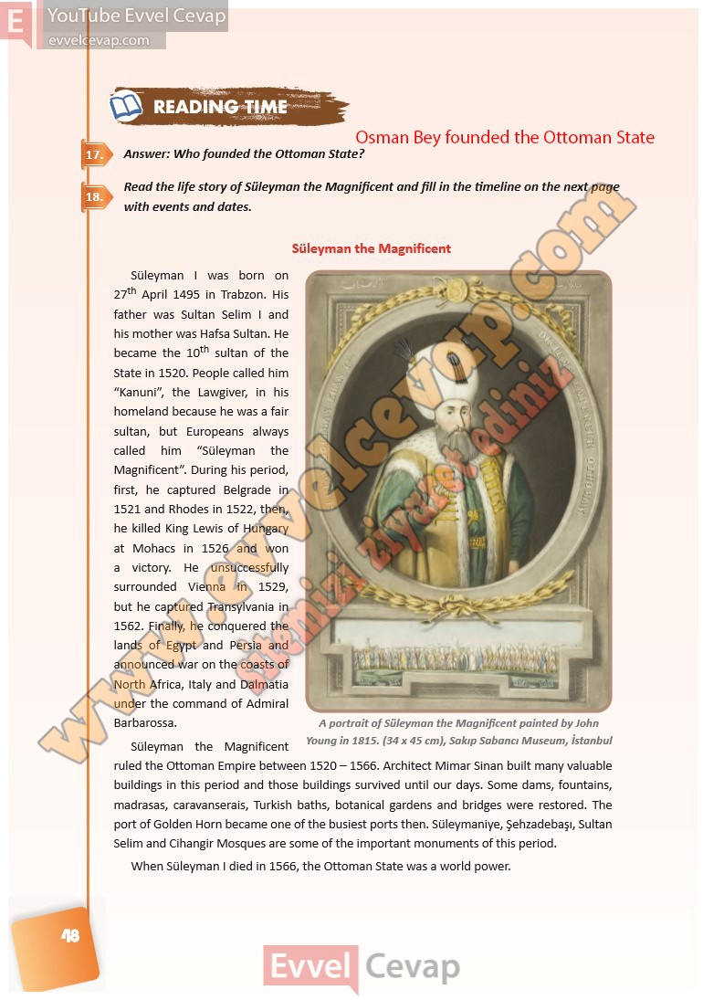

## 10. Sınıf İngilizce Ders Kitabı Cevapları Pasifik Yayınları Sayfa 48

**Soru: Answer: Who founded the Ottoman State?**

**Soru: Read the life story of Süleyman the Magnificent and fill in the timeline on the next page with events and dates.**

**10. Sınıf Pasifik Yayınları İngilizce Ders Kitabı Sayfa 48**