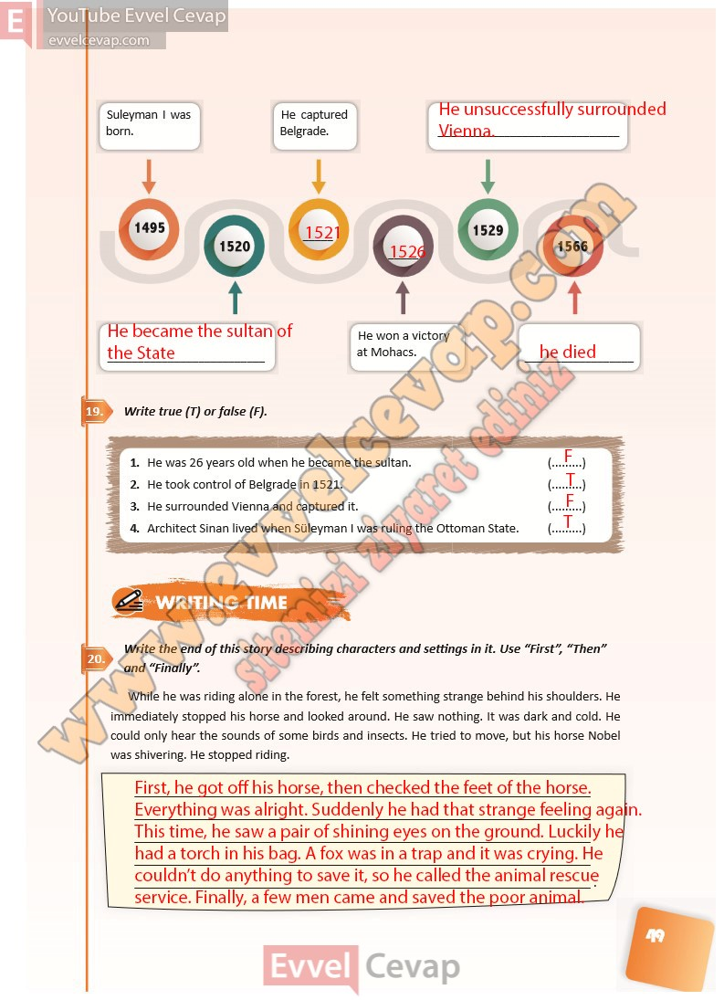

## 10. Sınıf İngilizce Ders Kitabı Cevapları Pasifik Yayınları Sayfa 49

**Soru: Write true (T) or false (F).**

1. He was 26 years old when he became the sultan.  
 2. He took control of Belgrade in 1521.  
 3. He surrounded Vienna and captured it.  
 4. Architect Sinan lived when Süleyman I was ruling the Ottoman State.

**Soru: Write the end of this story describing characters and settings in it. Use “First”, “Then” and “Finally”.**

**10. Sınıf Pasifik Yayınları İngilizce Ders Kitabı Sayfa 49**