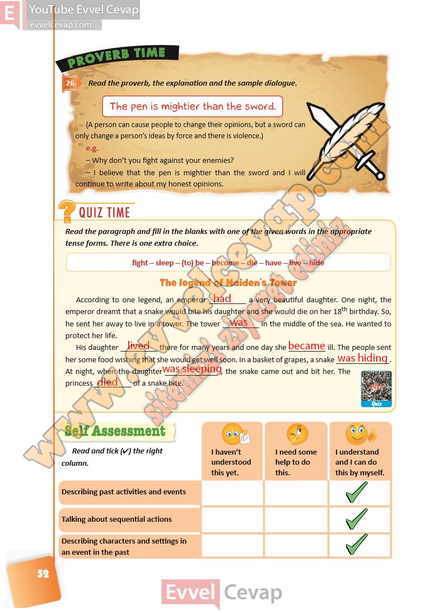

## 10. Sınıf İngilizce Ders Kitabı Cevapları Pasifik Yayınları Sayfa 52

**Soru: Read the proverb, the explanation and the sample dialogue.**

A person can cause people to change their opinions, but a sword can  
 only change a person’s ideas by force and there is violence.)  
 e.g.  
 – Why don’t you fight against your enemies?  
 – I believe that the pen is mightier than the sword and I will  
 continue to write about my honest opinions.

**Soru: Read the paragraph and fill in the blanks with one of the given words in the appropriate tense forms. There is one extra choice.**

**Soru: Read and tick (4) the right column.**

**10. Sınıf Pasifik Yayınları İngilizce Ders Kitabı Sayfa 52**