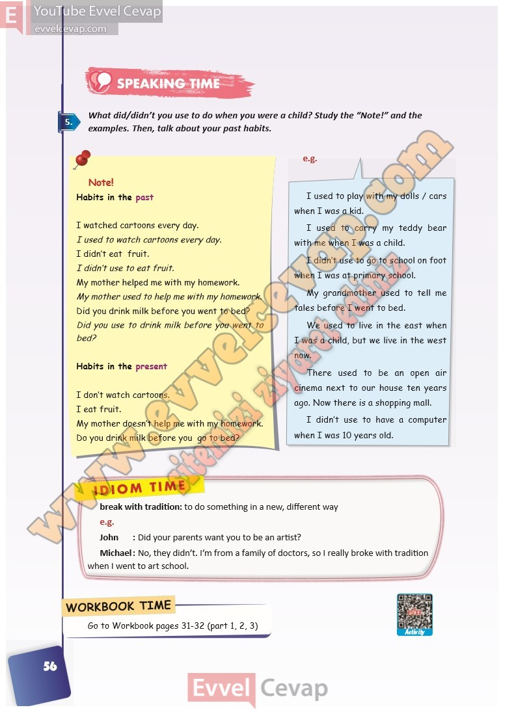

## 10. Sınıf İngilizce Ders Kitabı Cevapları Pasifik Yayınları Sayfa 56

**Soru: What did/didn’t you use to do when you were a chi ld? Study the “Note!” and the examples. Then, talk about your past habits.**

**10. Sınıf Pasifik Yayınları İngilizce Ders Kitabı Sayfa 56**