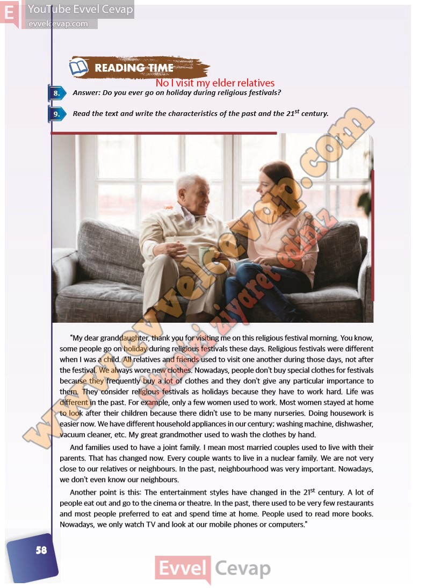

## 10. Sınıf İngilizce Ders Kitabı Cevapları Pasifik Yayınları Sayfa 58

**Soru: Answer: Do you ever go on holiday during religious festivals?**

**Soru: Read the text and write the characteristics of the past and the 21st century.**

**10. Sınıf Pasifik Yayınları İngilizce Ders Kitabı Sayfa 58**