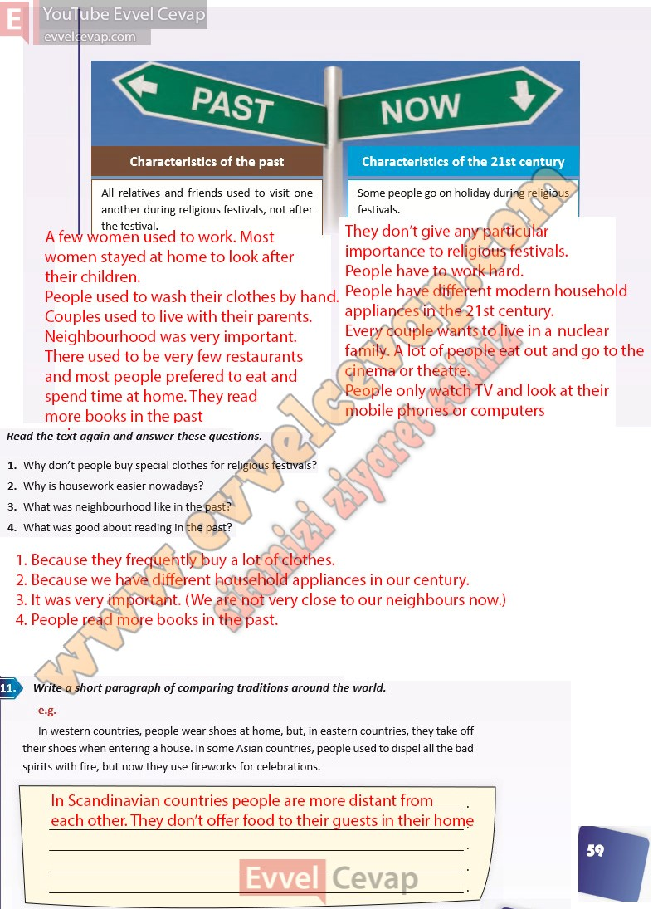

## 10. Sınıf İngilizce Ders Kitabı Cevapları Pasifik Yayınları Sayfa 59

All relatives and friends used to visit one another during religious festivals, not after the festival.

Some people go on holiday during religious festivals.

**Soru: Read the text again and answer these questions.**

**Soru: Why don’t people buy special clothes for religious festivals?**

**Soru: Why is housework easier nowadays?**

**Soru: What was neighbourhood like in the past?**

**Soru: What was good about reading in the past?**

**Soru: Write a short paragraph of comparing traditions around the world.**

**10. Sınıf Pasifik Yayınları İngilizce Ders Kitabı Sayfa 59**