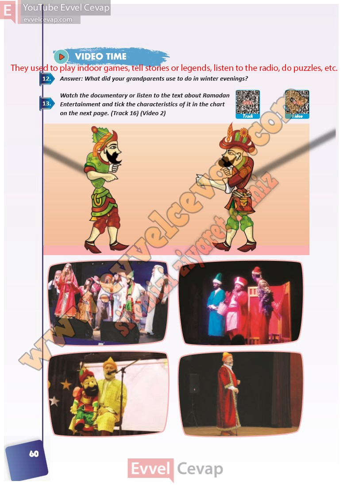

## 10. Sınıf İngilizce Ders Kitabı Cevapları Pasifik Yayınları Sayfa 60

**Soru: Answer: What did your grandparents use to do in winter evenings?**

**Soru: Watch the documentary or listen to the text about Ramadan Entertainment and tick the characteristics of it in the chart on the next page. (Track 16) (Video 2)**

**10. Sınıf Pasifik Yayınları İngilizce Ders Kitabı Sayfa 60**