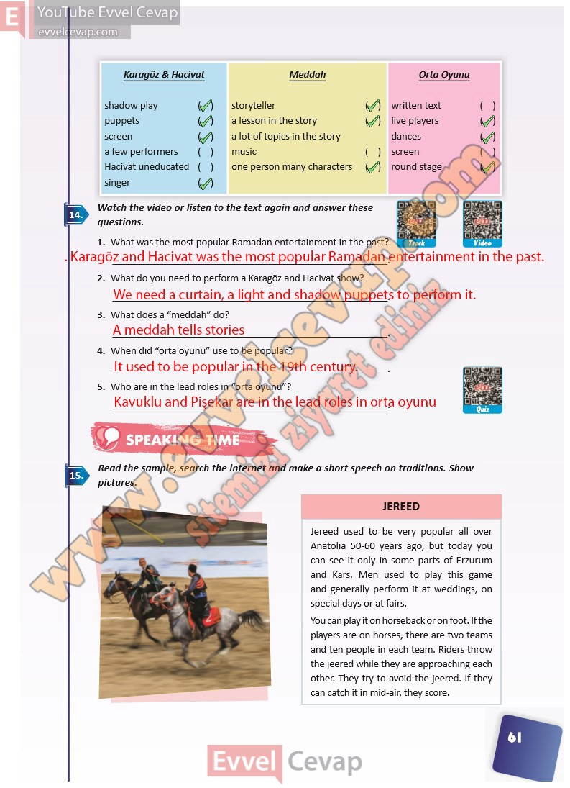

## 10. Sınıf İngilizce Ders Kitabı Cevapları Pasifik Yayınları Sayfa 61

**Soru: Watch the video or listen to the text again and answer these questions.**

**Soru: What was the most popular Ramadan entertainment in the past?**

**Soru: What do you need to perform a Karagöz and Hacivat show?**

**Soru: What does a “meddah” do?**

**Soru: When did “orta oyunu” use to be popular?**

**Soru: Who are in the lead roles in “orta oyunu”?**

**Soru: Read the sample, search the in ternet and make a short speech on traditions. Show pictures.**

**10. Sınıf Pasifik Yayınları İngilizce Ders Kitabı Sayfa 61**