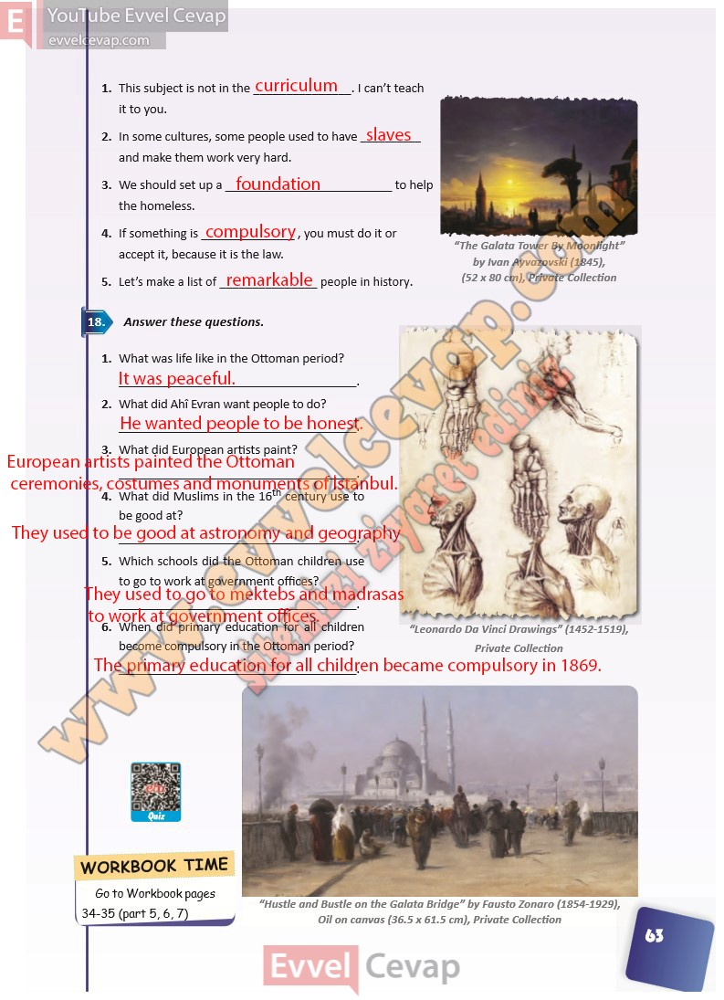

## 10. Sınıf İngilizce Ders Kitabı Cevapları Pasifik Yayınları Sayfa 63

1. This subject is not in the \_. I can’t teach it to you.  
 2. In some cultures, some people used to have \_ and make them work very hard.  
 3. We should set up a \_ to help the homeless.  
 4. If something is \_, you must do it or accept it, because it is the law.  
 5. Let’s make a list of \_ people in history.

**Soru: Answer these questions.**

**Soru: What was life like in the Ottoman period?**

**Soru: What did Ahî Evran want people to do?**

**Soru: What did European artists paint?**

**Soru: What did Muslims in the 16th century use to be good at?**

**Soru: Which schools did the Ottoman children use to go to work at government offices?**

**Soru: When did primary education for all children become compulsory in the Ottoman period?**

**10. Sınıf Pasifik Yayınları İngilizce Ders Kitabı Sayfa 63**