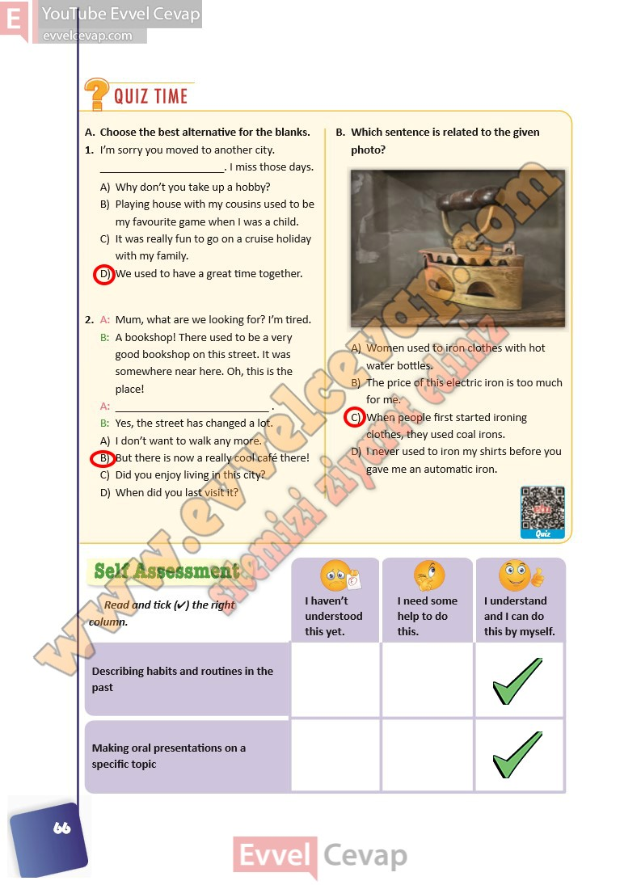

## 10. Sınıf İngilizce Ders Kitabı Cevapları Pasifik Yayınları Sayfa 66

**Soru: Choose the best alternative for the blanks.**

**Soru: I’m sorry you moved to another city. \_. I miss those days.**

A) Why don’t you take up a hobby?  
 B) Playing house with my cousins used to be  
 my favourite game when I was a child.  
 C) It was really fun to go on a cruise holiday  
 with my family.  
 D) We used to have a great time together.

**Soru: A: Mum, what are we looking for? I’m tired.  
 B: A bookshop! There used to be a very good bookshop on this street. It was somewhere near here. Oh, this is the place!  
 A: \_ .  
 B: Yes, the street has changed a lot.**

A) I don’t want to walk any more.  
 B) But there is now a really cool café there!  
 C) Did you enjoy living in this city?  
 D) When did you last visit it?

**Soru: Which sentence is related to the given photo?**

A) Women used to iron clothes with hot water bottles.  
 B) The price of this electric iron is too much for me.  
 C) When people first started ironing clothes, they used coal irons.  
 D) I never used to iron my shirts before you gave me an automatic iron.

**Soru: Read and tick (4) the right column.**

**10. Sınıf Pasifik Yayınları İngilizce Ders Kitabı Sayfa 66**