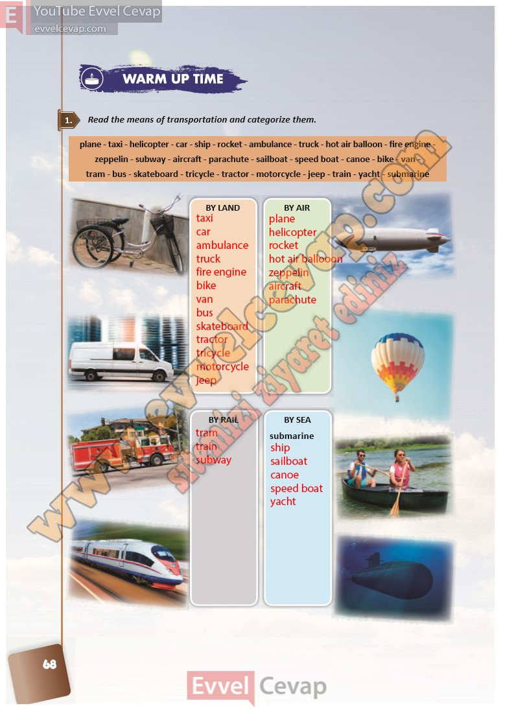

## 10. Sınıf İngilizce Ders Kitabı Cevapları Pasifik Yayınları Sayfa 68

**Soru: Read the means of transportation and categorize them.**

**10. Sınıf Pasifik Yayınları İngilizce Ders Kitabı Sayfa 68**