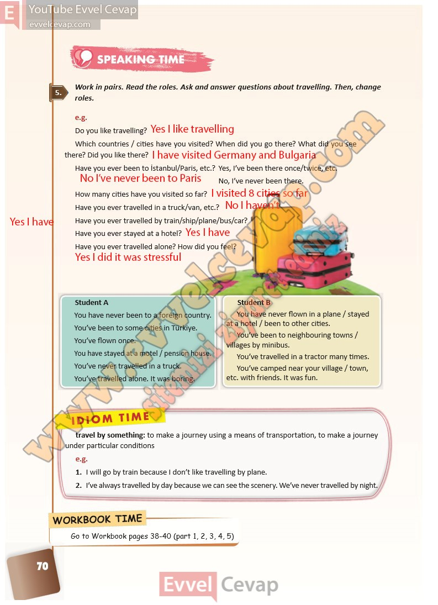

## 10. Sınıf İngilizce Ders Kitabı Cevapları Pasifik Yayınları Sayfa 70

**Soru: Work in pairs. Read the roles. Ask and ans wer questions about travelling. Then, change roles.**

e.g.  
 Do you like travelling?  
 Which countries / cities have you visited? When did you go there? What did you see  
 there? Did you like there?  
 Have you ever been to İstanbul/Paris, etc.? Yes, I’ve been there once/twice, etc.  
 No, I’ve never been there.  
 How many cities have you visited so far?  
 Have you ever travelled in a truck/van, etc.?  
 Have you ever travelled by train/ship/plane/bus/car?  
 Have you ever stayed at a hotel?  
 Have you ever travelled alone? How did you feel?

**10. Sınıf Pasifik Yayınları İngilizce Ders Kitabı Sayfa 70**