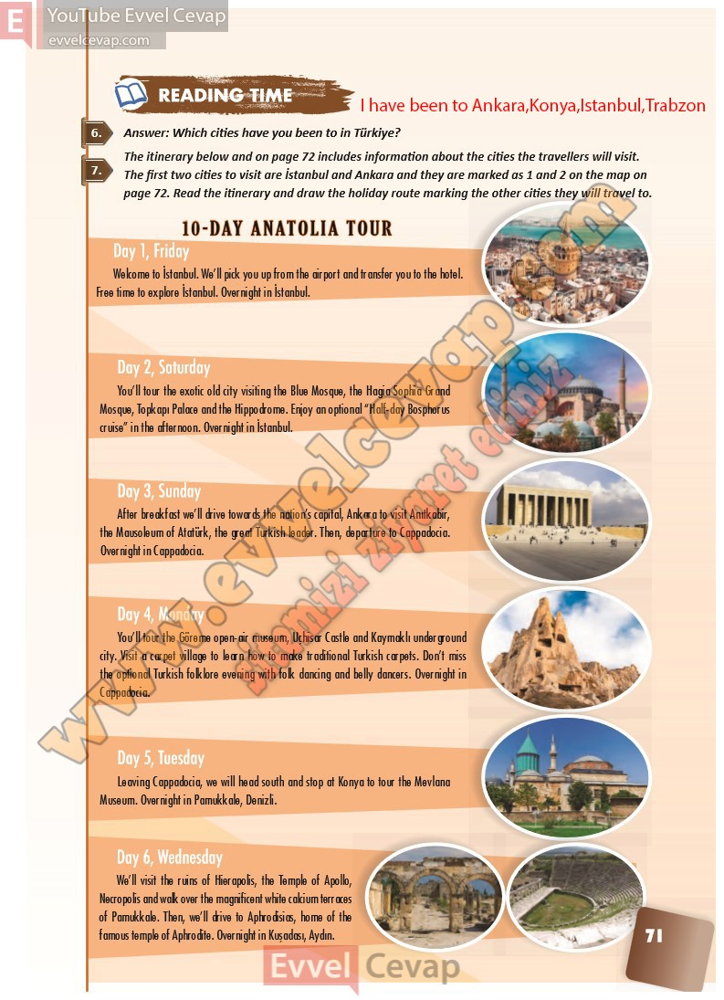

## 10. Sınıf İngilizce Ders Kitabı Cevapları Pasifik Yayınları Sayfa 71

**Soru: Answer: Which cities have you been to in Türkiye?**

**Soru: The itinerary below and on page 72 includes information about the cities the travellers will visit. The first two cities to visit are İstanbul and Ankara and they are marked as 1 and 2 on the map on page 72. Read the itinerary and draw the holiday route marking the other cities they will travel to.**

**10. Sınıf Pasifik Yayınları İngilizce Ders Kitabı Sayfa 71**