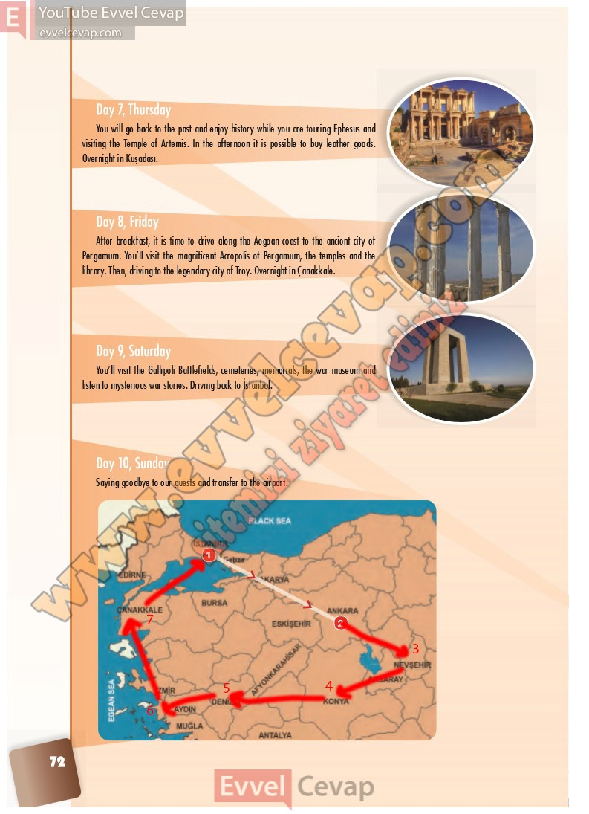

## 10. Sınıf İngilizce Ders Kitabı Cevapları Pasifik Yayınları Sayfa 72

**Soru: The itinerary below and on page 72 includes information about the cities the travellers will visit. The first two cities to visit are İstanbul and Ankara and they are marked as 1 and 2 on the map on page 72. Read the itinerary and draw the holiday route marking the other cities they will travel to.**

You will go back to the past and enjoy history while you are touring Ephesus and visiting the Temple of Artemis. In the afternoon it is possible to buy leather goods. Overnight in Kuşadası

After breakfast, it is time to drive along the Aegean coast to the ancient city of Pergamum. You’ll visit the magnificent Acropolis of Pergamum, the temples and the library. Then, driving to the legendary city of Troy. Overnight in Çanakkale.

You’ll visit the Gallipoli Battlefields, cemeteries, memorials, the war museum and listen to mysterious war stories. Driving back to İstanbul.

Saying goodbye to our guests and transfer to the airport.

**10. Sınıf Pasifik Yayınları İngilizce Ders Kitabı Sayfa 72**