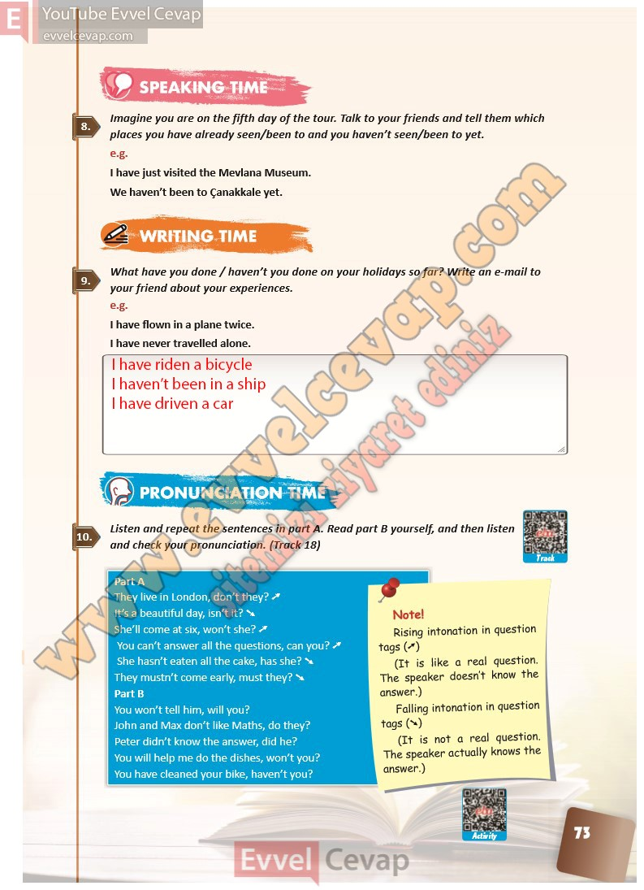

## 10. Sınıf İngilizce Ders Kitabı Cevapları Pasifik Yayınları Sayfa 73

**Soru: Imagine you are on the fifth day of the t our. Talk to your friends and tell them which places you have already seen/been t o and you haven’t seen/been t o yet.**

I have just visited the Mevlana Museum.  
 We haven’t been to Çanakkale yet.

**Soru: What have you done / haven’t you done on your holidays so f ar? Write an e-mail to your friend about your experiences.**

I have flown in a plane twice.  
 I have never travelled alone.

**Soru: Listen and repeat the sentences in part A. Read part B yourself, and then listen and check your pronunciation. (Track 18)**

**10. Sınıf Pasifik Yayınları İngilizce Ders Kitabı Sayfa 73**