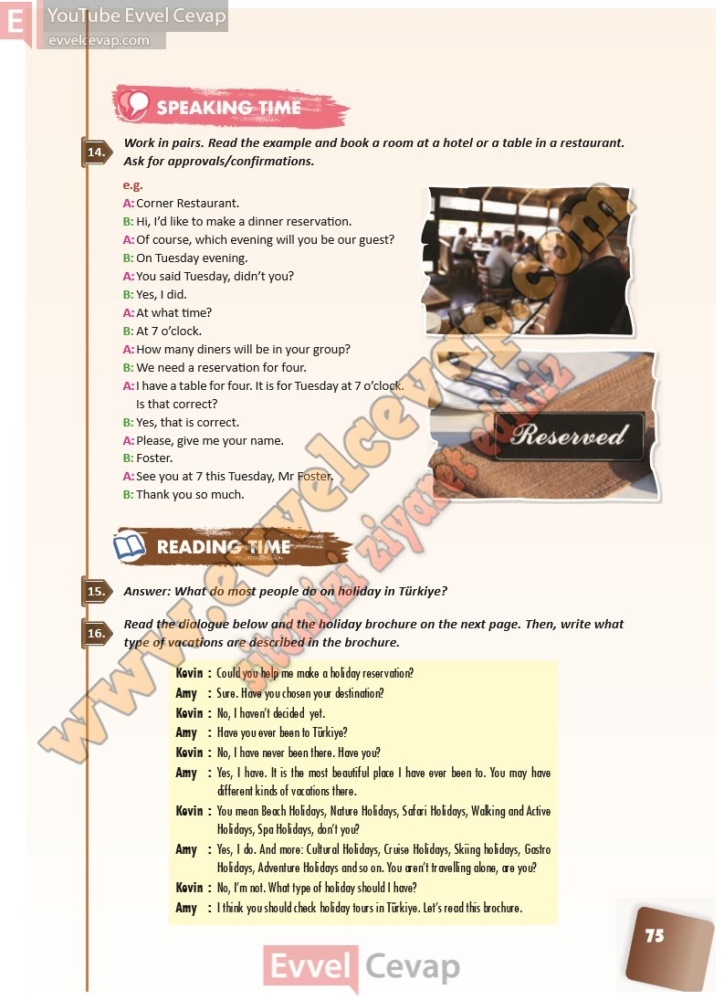

## 10. Sınıf İngilizce Ders Kitabı Cevapları Pasifik Yayınları Sayfa 75

**Soru: Work in pairs. Read the example and book a room at a hot el or a table in a restaurant. Ask for approvals/confirmations.**

**Soru: Answer: What do most people do on holiday in Türkiye?**

**Soru: Read the dialogue below and the holiday brochure on the ne xt page. Then, write what type of vacations are described in the brochure.**

**10. Sınıf Pasifik Yayınları İngilizce Ders Kitabı Sayfa 75**