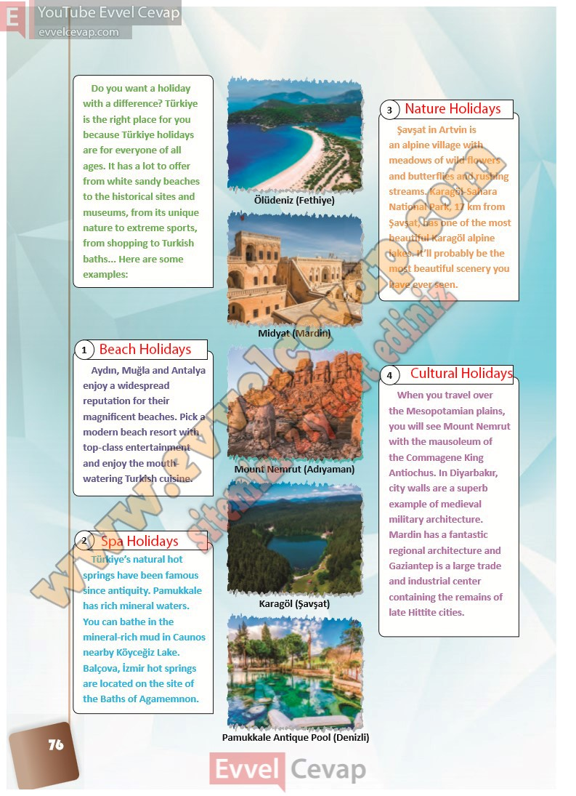

## 10. Sınıf İngilizce Ders Kitabı Cevapları Pasifik Yayınları Sayfa 76

Do you want a holiday with a difference? Türkiye is the right place for you because Türkiye holidays are for everyone of all ages. It has a lot to offer from white sandy beaches to the historical sites and museums, from its unique nature to extreme sports, from shopping to Turkish baths… Here are some examples:

Aydın, Muğla and Antalya enjoy a widespread reputation for their magnificent beaches. Pick a modern beach resort with top-class entertainment and enjoy the mouth- watering Turkish cuisine.

Türkiye’s natural hot  
 springs have been famous since antiquity. Pamukkale has rich mineral waters.  
 You can bathe in the mineral-rich mud in Caunos nearby Köyceğiz Lake. Balçova, İzmir hot springs are located on the site of the Baths of Agamemnon.

Şavşat in Artvin is an alpine village with meadows of wild flowers and butterflies and rushing streams. Karagöl-Sahara National Park, 17 km from Şavşat, has one of the most beautiful Karagöl alpine lakes. It’ll probably be the most beautiful scenery you have ever seen.

When you travel over the Mesopotamian plains, you will see Mount Nemrut with the mausoleum of the Commagene King Antiochus. In Diyarbakır, city walls are a superb example of medieval military architecture. Mardin has a fantastic regional architecture and Gaziantep is a large trade and industrial center containing the remains of late Hittite cities.

**10. Sınıf Pasifik Yayınları İngilizce Ders Kitabı Sayfa 76**