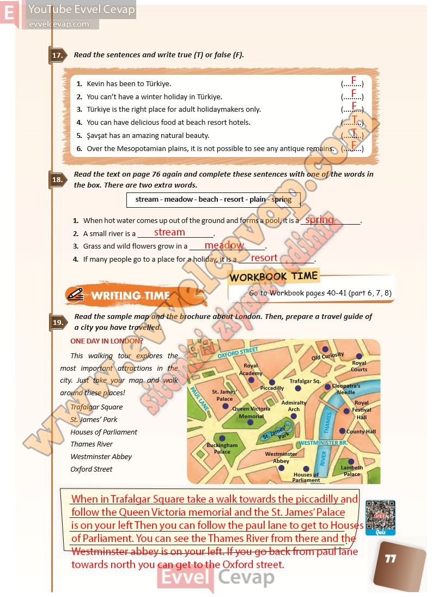

## 10. Sınıf İngilizce Ders Kitabı Cevapları Pasifik Yayınları Sayfa 77

**Soru: Read the sentences and write true (T) or false (F).**

1. Kevin has been to Türkiye.  
 2. You can’t have a winter holiday in Türkiye.  
 3. Türkiye is the right place for adult holidaymakers only.  
 4. You can have delicious food at beach resort hotels.  
 5. Şavşat has an amazing natural beauty.  
 6. Over the Mesopotamian plains, it is not possible to see any antique remains.

**Soru: Read the text on page 76 again and c omplete these sentences with one of the words in the box. There are two extra words.**

1. When hot water comes up out of the ground and forms a pool, it is a \_  
 2. A small river is a \_  
 3. Grass and wild flowers grow in a \_  
 4. If many people go to a place for a holiday, it is a \_

**Soru: Read the sample map and the brochure about London. Then, prepare a travel guide of a city you have travelled.**

**10. Sınıf Pasifik Yayınları İngilizce Ders Kitabı Sayfa 77**