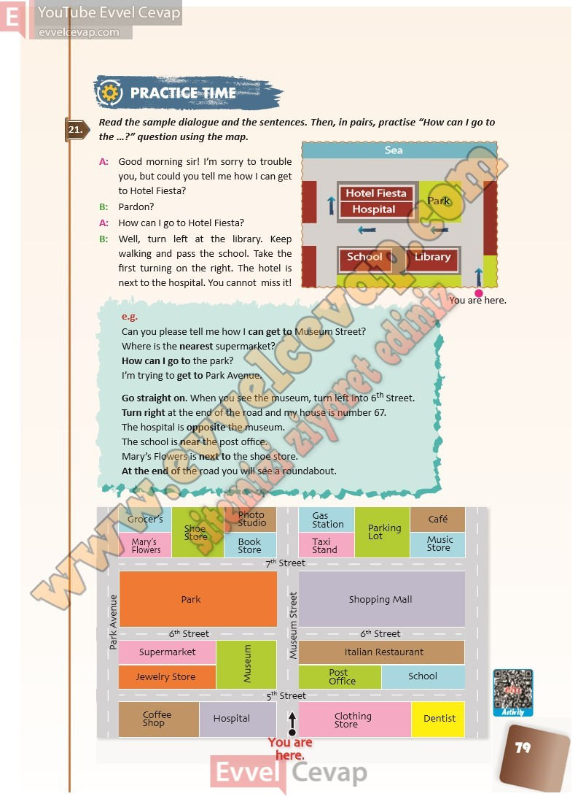

## 10. Sınıf İngilizce Ders Kitabı Cevapları Pasifik Yayınları Sayfa 79

**Soru: Read the sample dialogue and the sen tences. Then, in pairs, practise “Ho w can I go to the …?” question using the map.**

**10. Sınıf Pasifik Yayınları İngilizce Ders Kitabı Sayfa 79**