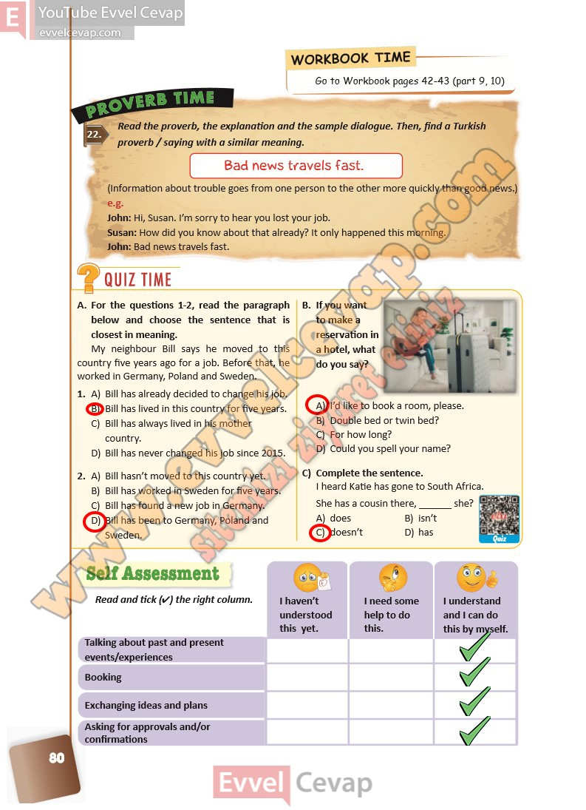

## 10. Sınıf İngilizce Ders Kitabı Cevapları Pasifik Yayınları Sayfa 80

**Soru: Read the proverb, the explanation and the sample dialogue. Then, find a Turkish proverb / saying with a similar meaning.**

**Soru: For the questions 1-2, read the paragraph below and choose the sentence that is closest in meaning**

My neighbour Bill says he moved to this country five years ago for a job. Before that, he worked in Germany, Poland and Sweden.  
 1. A) Bill has already decided to change his job.  
 B) Bill has lived in this country for five years.  
 C) Bill has always lived in his mother country.  
 D) Bill has never changed his job since 2015.  
 2. A) Bill hasn’t moved to this country yet.  
 B) Bill has worked in Sweden for five years.  
 C) Bill has found a new job in Germany.  
 D) Bill has been to Germany, Poland and Sweden.

**Soru: If you want to make a reservation in a hotel, what do you say?**

A) I’d like to book a room, please.  
 B) Double bed or twin bed?  
 C) For how long?  
 D) Could you spell your name?

**Soru: Complete the sentence. I heard Katie has gone to South Africa. She has a cousin there, \_ she?**

A) does  
 B) isn’t  
 C) doesn’t  
 D) has

**Soru: Read and tick (4) the right column.**

**10. Sınıf Pasifik Yayınları İngilizce Ders Kitabı Sayfa 80**