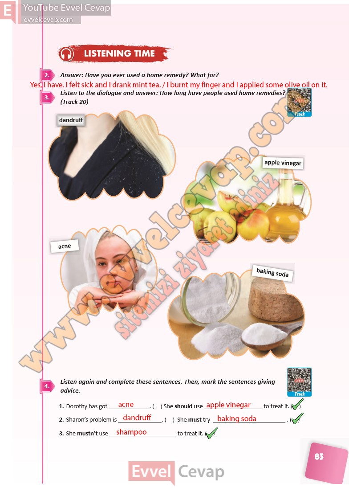

## 10. Sınıf İngilizce Ders Kitabı Cevapları Pasifik Yayınları Sayfa 83

**Soru: Answer: Have you ever used a home remedy? What f or?**

**Soru: Listen to the dialogue and answer: How long have people used home remedies? (Track 20)**

**Soru: Listen again and complete these sentences. Then, mark the sentences giving advice.**

**10. Sınıf Pasifik Yayınları İngilizce Ders Kitabı Sayfa 83**