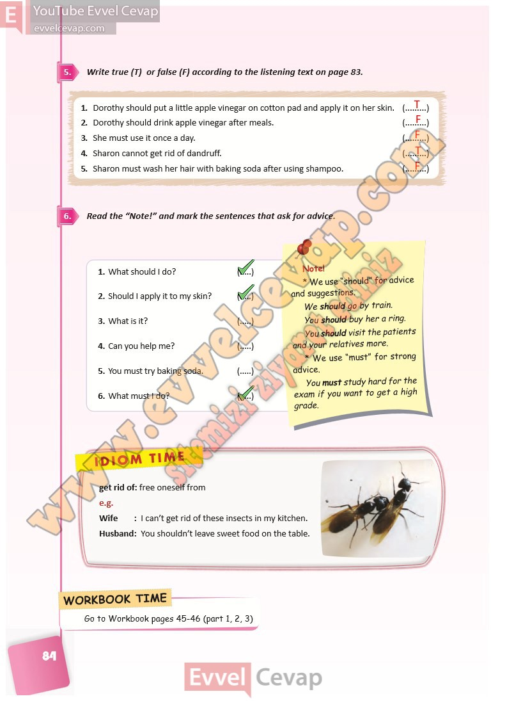

## 10. Sınıf İngilizce Ders Kitabı Cevapları Pasifik Yayınları Sayfa 84

**Soru: Write true (T) or false (F) according to the listening text on page 83.**

1. Dorothy should put a little apple vinegar on cotton pad and apply it on her skin.  
 2. Dorothy should drink apple vinegar after meals.  
 3. She must use it once a day.  
 4. Sharon cannot get rid of dandruff.  
 5. Sharon must wash her hair with baking soda after using shampoo.

**Soru: Read the “Note!” and mark the sentences that ask for advice.**

**Soru: What should I do?**

**Soru: Should I apply it to my skin?**

**Soru: What is it?**

**Soru: Can you help me?**

**Soru: You must try baking soda.**

**Soru: What must I do?**

**10. Sınıf Pasifik Yayınları İngilizce Ders Kitabı Sayfa 84**