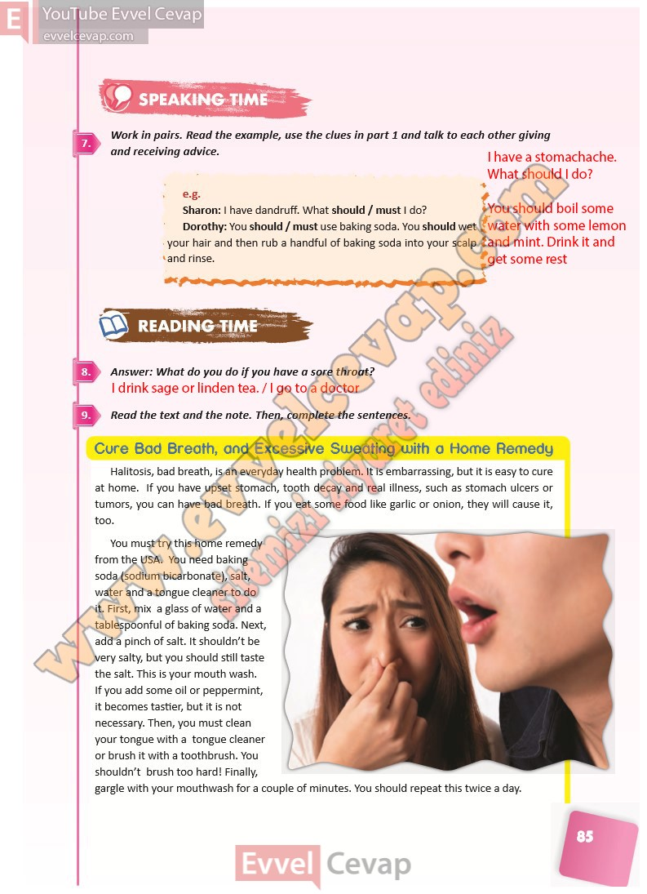

## 10. Sınıf İngilizce Ders Kitabı Cevapları Pasifik Yayınları Sayfa 85

**Soru: Work in pairs. Read the example, use the clues in part 1 and t alk to each other giving and receiving advice.**

**Soru: Answer: What do you do if you have a sore throat?**

**Soru: Read the text and the note. Then, complete the sentences.**

**10. Sınıf Pasifik Yayınları İngilizce Ders Kitabı Sayfa 85**