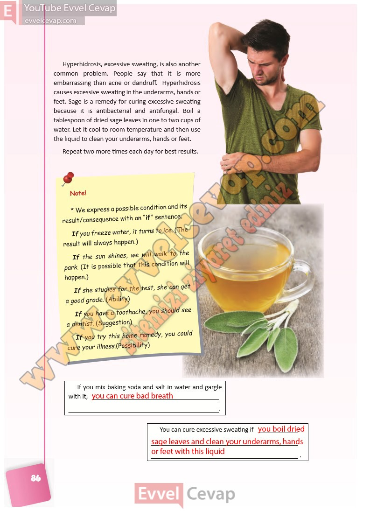

## 10. Sınıf İngilizce Ders Kitabı Cevapları Pasifik Yayınları Sayfa 86

Hyperhidrosis, excessive sweating, is also another common problem. People say that it is more embarrassing than acne or dandruff. Hyperhidrosis causes excessive sweating in the underarms, hands or feet. Sage is a remedy for curing excessive sweating because it is antibacterial and antifungal. Boil a tablespoon of dried sage leaves in one to two cups of water. Let it cool to room temperature and then use the liquid to clean your underarms, hands or feet. Repeat two more times each day for best results.

\* We express a possible condition and its  
 result/consequence with an “if” sentence.  
 If you freeze water, it turns to ice. (The  
 result will always happen.)  
 If the sun shines, we will walk to the  
 park. (It is possible that this condition will  
 happen.)  
 If she studies for the test, she can get  
 a good grade. (Ability)  
 If you have a toothache, you should see  
 a dentist. (Suggestion)  
 If you try this home remedy, you could  
 cure your illness.(Possibility)

**Soru: If you mix baking soda and salt in water and gargle with it,**

**Soru: You can cure excessive sweating if**

**10. Sınıf Pasifik Yayınları İngilizce Ders Kitabı Sayfa 86**