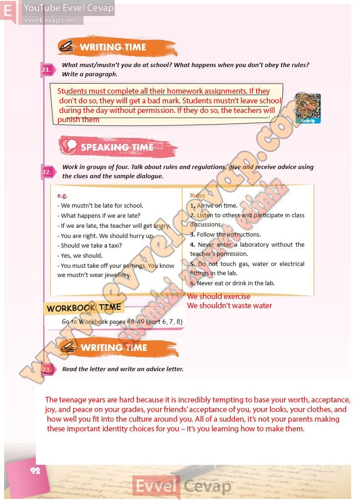

## 10. Sınıf İngilizce Ders Kitabı Cevapları Pasifik Yayınları Sayfa 92

**Soru: What must/mustn’t you do at school? What happens when you don’t obe y the rules? Write a paragraph.**

**Soru: Work in groups of four. Talk about rules and regulations, give and receive advice using the clues and the sample dialogue.**

**Soru: Read the letter and write an advice letter.**

**10. Sınıf Pasifik Yayınları İngilizce Ders Kitabı Sayfa 92**