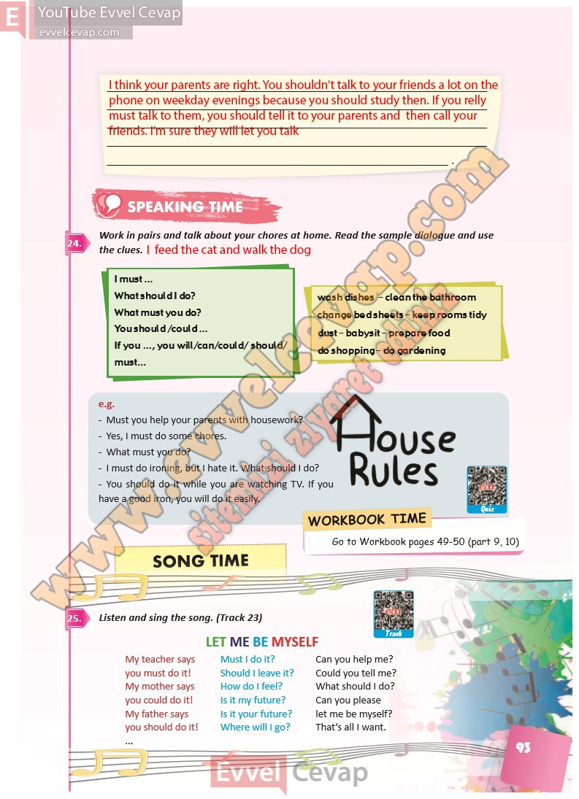

## 10. Sınıf İngilizce Ders Kitabı Cevapları Pasifik Yayınları Sayfa 93

**Soru: Work in pairs and talk about your chores at home. R ead the sample dialogue and use the clues.**

– Must you help your parents with housework?  
 – Yes, I must do some chores.  
 – What must you do?  
 – I must do ironing, but I hate it. What should I do?  
 – You should do it while you are watching TV. If you have a good iron, you will do it easily.

**Soru: Listen and sing the song. (Track 23)**

**10. Sınıf Pasifik Yayınları İngilizce Ders Kitabı Sayfa 93**