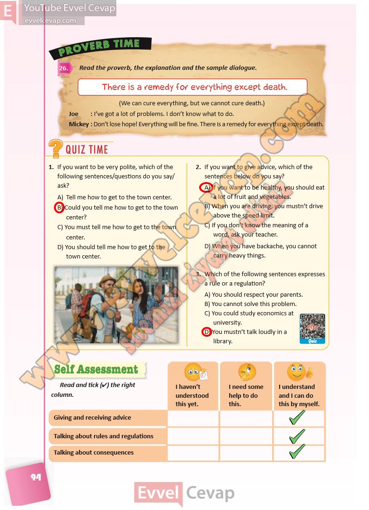

## 10. Sınıf İngilizce Ders Kitabı Cevapları Pasifik Yayınları Sayfa 94

**Soru: Read the proverb, the explanation and the sample dialogue.**

**Soru: If you want to be very polite, which of the following sentences/questions do you say/ ask?**

A) Tell me how to get to the town center.  
 B) Could you tell me how to get to the town center?  
 C) You must tell me how to get to the town center.  
 D) You should tell me how to get to the town center.

**Soru: If you want to give advice, which of the sentences below do you say?**

A) If you want to be healthy, you should eat a lot of fruit and vegetables.  
 B) When you are driving, you mustn’t drive above the speed limit.  
 C) If you don’t know the meaning of a word, ask your teacher.  
 D) When you have backache, you cannot carry heavy things.

**Soru: Which of the following sentences expresses a rule or a regulation?**

A) You should respect your parents.  
 B) You cannot solve this problem.  
 C) You could study economics at university.  
 D) You mustn’t talk loudly in a library.

**Soru: Read and tick (4) the right column.**

**10. Sınıf Pasifik Yayınları İngilizce Ders Kitabı Sayfa 94**