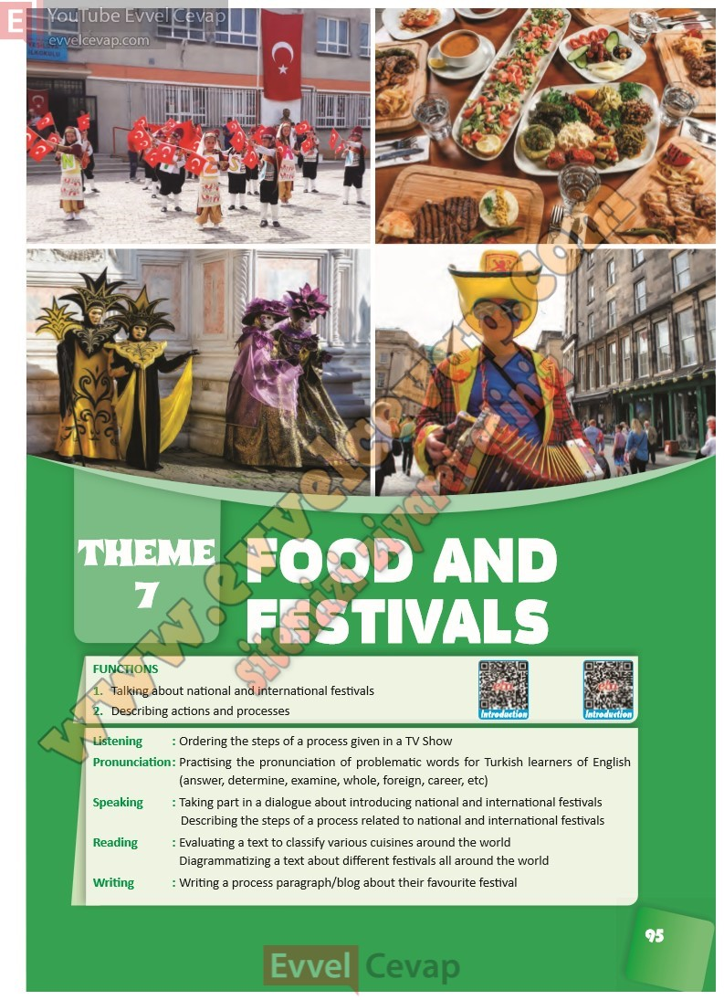

## 10. Sınıf İngilizce Ders Kitabı Cevapları Pasifik Yayınları Sayfa 95

1. Talking about national and international festivals  
 2. Describing actions and processes  
 Listening : Ordering the steps of a process given in a TV Show  
 Pronunciation : Practising the pronunciation of problematic words for Turkish learners of English  
 (answer, determine, examine, whole, foreign, career, etc)  
 Speaking : Taking part in a dialogue about introducing national and international festivals  
 Describing the steps of a process related to national and international festivals  
 Reading : Evaluating a text to classify various cuisines around the world  
 Diagrammatizing a text about different festivals all around the world  
 Writing : Writing a process paragraph/blog about their favourite festival

**10. Sınıf Pasifik Yayınları İngilizce Ders Kitabı Sayfa 95**