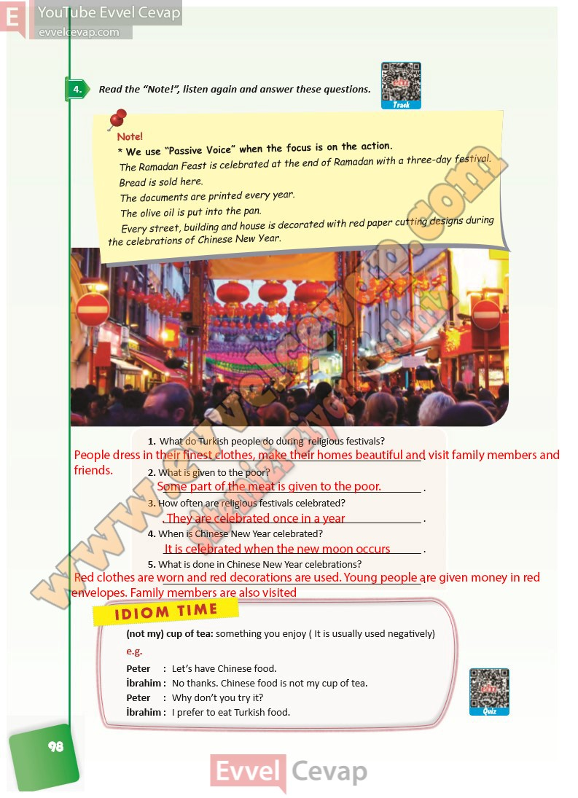

## 10. Sınıf İngilizce Ders Kitabı Cevapları Pasifik Yayınları Sayfa 98

**Soru: Read the “Note!”, listen again and answer these questions.**

**Soru: What do Turkish people do during religious festivals?**

**Soru: What is given to the poor?**

**Soru: How often are religious festivals celebrated?**

**Soru: When is Chinese New Year celebrated?**

**Soru: What is done in Chinese New Year celebrations?**

**10. Sınıf Pasifik Yayınları İngilizce Ders Kitabı Sayfa 98**