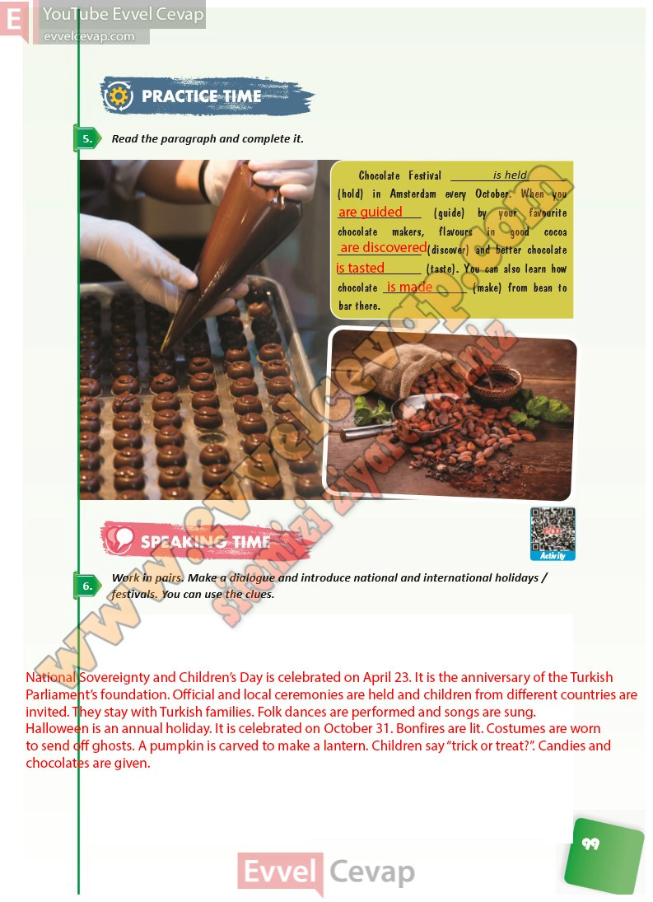

## 10. Sınıf İngilizce Ders Kitabı Cevapları Pasifik Yayınları Sayfa 99

**Soru: Read the paragraph and complete it.**

**Soru: Work in pairs. Make a dialogue and introduce national and international holidays / festivals. You can use the clues.**

**10. Sınıf Pasifik Yayınları İngilizce Ders Kitabı Sayfa 99**