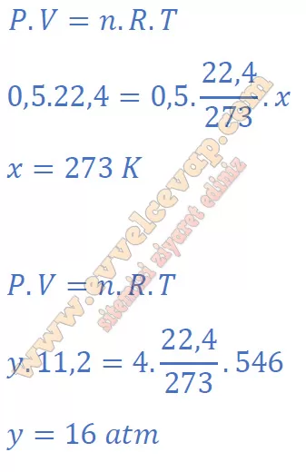

## 10. Sınıf Kimya Ders Kitabı Cevapları Meb Yayınları Sayfa 100

**Soru: 3) İdeal gaz denkleminde bulmuş olduğunuz sabit sayıya ideal gaz sabiti adı verilir. R harfi ile gösterilir. Aşağıdaki tabloda verilen değerler için ideal gaz sabitini ayrı ayrı hesaplayınız.**

**Soru: 4) Aşağıdaki koşullar için x ve y değerlerini hesaplayarak ideal gaz denklemini test ediniz.**

**Değerlendirme**

**Soru: 1) Verilen basınç-hacim grafiğinden yararlanarak bir gazın 1/V-P grafiğini çiziniz.**

**Soru: 2) İdeal gaz denkleminde mutlak sıcaklık yerine °C kullanılabilir mi? Düşüncelerinizi yazınız.**

* **Cevap**: Hayır. İdeal gaz denkleminde sıcaklık mutlak (Kelvin) olmalıdır; °C kullanılırsa doğru orantı bozulur (T(K)=t(∘C)+273).

**10. Sınıf Meb Yayınları Kimya Ders Kitabı Sayfa 100**