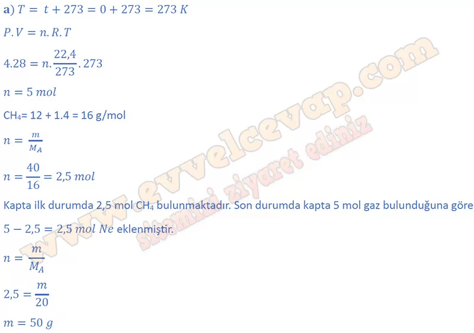
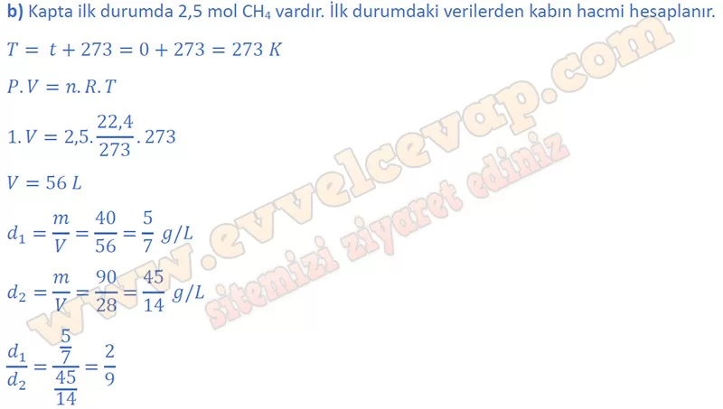
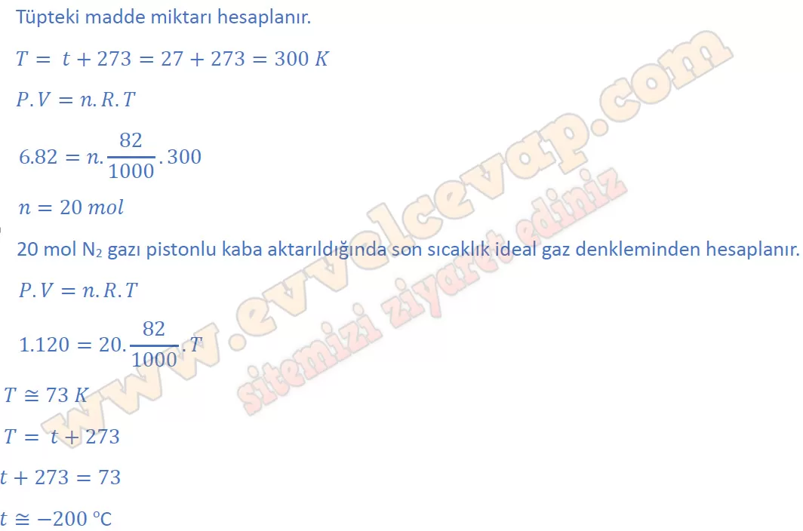

## 10. Sınıf Kimya Ders Kitabı Cevapları Meb Yayınları Sayfa 104

**Soru: 4) STP’de yandaki kapalı kapta 40 g CH4 gazı bulunmaktadır. Sabit sıcaklıkta kaba bir miktar Ne gazı ilave edilip kabın hacmi 28 L’ye sabitleniyor. Son durumdaki basınç 4 atm olarak ölçülüyor. Buna göre;**

**Soru: a) Kaba kaç g Ne gazı eklenmiştir?**

**Soru: b) Kaptaki gaz yoğunluğu ilk durumda d,, son durumda d2 ise d1/d2 kaçtır?**

**Soru: 5) Yandaki şekilde verilen N2 gazı ile dolu 82 L’lik bir tüp, 27 °C sıcaklıkta 6 atm basınç yapmaktadır. Bir hortum yardımıyla tüpün içindeki gazın tamamı dış basıncın 1 atm olduğu bir ortamda bulunan 120 L’lik ideal pistonlu bir kaba aktarılıyor. Pistonun kaptan fırlamaması için ortamın sıcaklığı en fazla kaç °C olmalıdır?**

**10. Sınıf Meb Yayınları Kimya Ders Kitabı Sayfa 104**