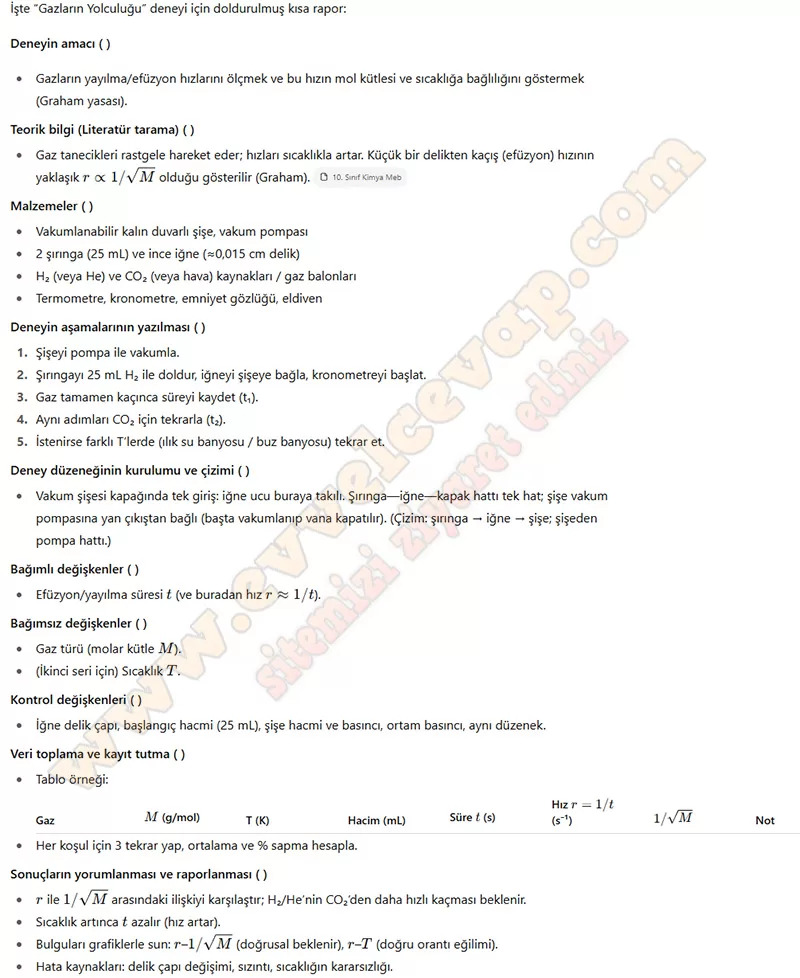

## 10. Sınıf Kimya Ders Kitabı Cevapları Meb Yayınları Sayfa 108

**DENEY TASARLAMA FORMU**

**Soru: 3) Doğal gaz sızıntılarını fark etmek için kokusu çürük sarımsağa benzeyen metil merkaptan bileşiği doğal gaza ilave edilir. Bu sayede doğal gaz sızıntıları çok düşük yoğunluklarda bile algılanabilir. Atmosferdeki oksijen, azot, karbon dioksit gibi çeşitli gazlar dengeli ve homojen bir şekilde dağılır. Günlük hayattan verilen bu örnekleri deney sonrasında elde edilen sonuçlara göre açıklayınız.**

* **Cevap**: Metil merkaptanın kokusunun hızla fark edilmesi gazların difüzyon özelliğiyle ilgilidir; gaz tanecikleri rastgele hareket ederek kısa sürede homojen dağılır. Atmosferdeki gazların da eşit ve dengeli şekilde karışması bu özelliğin sonucudur.

**Soru: 4) Deney sürecinde karşılaştığınız zorluklarla başa çıkarken alternatif çözümler geliştirebildiniz mi? Yeni bir durumla karşılaştığınızda bu duruma nasıl uyum sağladığınızı ve hangi yöntemleri uyguladığınızı yazınız.**

* **Cevap**: Deney sırasında gazların sızma süresini ölçerken zamanlama zorlukları yaşanabilir; bu durumda kronometre yerine dijital sensör kullanılabilir. Yeni durumlarda ekip içinde görev paylaşımı yaparak, farklı yöntemler (örneğin deney ortamının sıcaklığını sabit tutmak için su banyosu) uygulayarak uyum sağlanmıştır.

**10. Sınıf Meb Yayınları Kimya Ders Kitabı Sayfa 108**