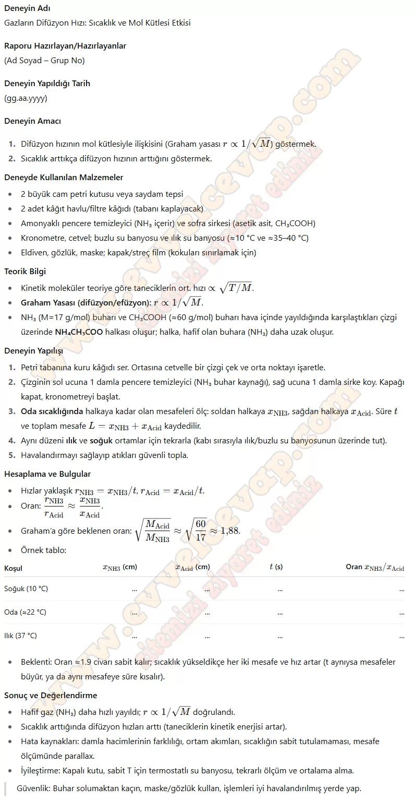

## 10. Sınıf Kimya Ders Kitabı Cevapları Meb Yayınları Sayfa 113

**Soru: Bu bölümde sizden gazların farklı ortamlarda yayılması sırasında difüzyon hızlarının sıcaklık ve mol kütlesi ile ilişkilerini ortaya koyan bir deney tasarlamanız beklenmektedir. Deneyinize başlamadan önce yol haritası oluşturmak, zamanı etkili ve verimli kullanmanız açısından önemlidir. Aşağıdaki basamakları dikkate alarak kendinize bir plan oluşturunuz ve bilimsel, araştırmacı bakış açısıyla deneyinizi gerçekleştiriniz.**

1. Deneyde gerekli olan bilgilere ulaşmak için güvenilir kaynaklardan (.edu, .gov uzantılı siteler, makale, kitap vb.) araştırma yapınız.  
 2. Deneyde test edeceğiniz bağımlı, bağımsız değişkenleri ve kontrol değişkenlerini seçiniz.  
 3. Uygun deney malzemelerini belirleyiniz (Deney malzemelerinin günlük hayatta kolaylıkla bulunabilir ve çevreye zararsız olmasına özen gösteriniz.).  
 4. Gerekli güvenlik önlemlerini alarak aşağıdaki deney raporuna uygun şekilde deneyinizi gerçekleştiriniz.

**10. Sınıf Meb Yayınları Kimya Ders Kitabı Sayfa 113**