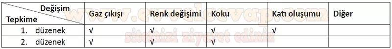

## 10. Sınıf Kimya Ders Kitabı Cevapları Meb Yayınları Sayfa 116

**Bu bölümde farklı soru tiplerini içeren 77 soru bulunmaktadır.**

**Soru: 1-4. soruları aşağıdaki metne göre cevaplayınız.**

Süt; protein, karbonhidrat, yağ, vitamin ve mineraller içeren beyaz renkli, besleyici bir gıdadır. Yapısında bulunan maddelerin özelliklerini kaybetmemesi için sütün belli koşullarda saklanması gerekmektedir. Pastörize ve UHT işlemi günümüzde en sık kullanılan yöntemlerden olsa da evlerde bu işlem sütün kaynatılması ile gerçekleşir. Yüksek sıcaklıklarda ısıtılan sütten açığa çıkan H2S gazı, pişmiş süte has tat ve koku sağlamaktadır. Isıtma işlemine devam edilirse laktoz şekeri esmerleşme tepkimesi vererek karamel rengine dönüşür. İçerdiği zayıf organik asitler sayesinde sütün pH değeri yaklaşık 6,6 ila 6,8’dir. Uygun koşullarda saklanmayan sütte çoğalan bakteriler laktik asit üreterek sütün pH seviyesini düşürür. pH seviyesinin yaklaşık 5,1 değerinin altına düşmesi sonucu sütteki kazein proteini Ca2+ gibi iyonlarla birleşerek çökelek oluşturur. Bu esnada çökeleğin üst kısmında kalan sıvı, sarımsı-yeşil bir renk alır.

**Soru: 1) Sütün yapısında meydana gelen bu değişimlerden gözlemlenebilir olanlar nelerdir? Listeleyiniz.**

* **Cevap**: Sütün tat ve kokusunun değişmesi. Sütün çok ısıtılması sonucu renginin kahverengiye dönmesi. Sütün yapısının bozularak çökelek oluşması ve bu esnada sütün renginin değişmesi.

**Soru: 2) Metinde okuduğu kimyasal değişimleri gözlemlemek isteyen bir öğrenci aşağıdaki düzenekleri kuruyor. Her iki düzenekte yapılan gözlemler sonucunda, kimyasal değişimi gösteren hangi veriler elde edilebilir? Aşağıdaki tabloya yazınız.**

**10. Sınıf Meb Yayınları Kimya Ders Kitabı Sayfa 116**