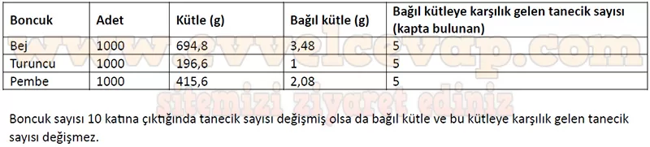

## 10. Sınıf Kimya Ders Kitabı Cevapları Meb Yayınları Sayfa 122

**Soru: 15-19. soruları aşağıdaki görsele ve verilere göre cevaplayınız.**

Aşağıda takı yapımında kullanılan farklı renk ve büyüklüklerde boncuklar verilmiştir.  
 Bej, turuncu ve pembe boncuklardan yüzer adet alınarak boncukların kütleleri ayrı ayrı tartılmıştır. Daha sonra tartılan kütleler, kütlesi en küçük olan boncuğun (turuncu) kütlesine bölünerek bağıl kütleler hesaplanmıştır. Bulunan bağıl kütlelere karşılık gelecek kadar boncuk tartılarak ayrı kaplara konulmuş ve kaplardaki boncuklar tek tek sayılmıştır. Boncuklara ait bilgiler aşağıdaki tabloda verilmiştir.

**Soru: 15) Yukarıdaki boncuklarla yapılacak bir kolye için satın alınması gereken her bir boncuk miktarını hangi ölçü birimiyle ifade etmek daha uygun olur?**

* **Cevap**: Küçük boyuttaki boncuklar gram ile, büyük boyuttaki boncuklar tane ile ölçülebilir.

**Soru: 16) Tablodaki hesaplanan boncuk sayısı 10 katına çıkarılmış olsaydı bağıl kütle ve bağıl kütleye karşılık gelen tanecik sayısında nasıl bir değişim olurdu? Tablo üzerindeki verilerden yararlanarak gerekli hesaplamaları yapınız.**

**10. Sınıf Meb Yayınları Kimya Ders Kitabı Sayfa 122**