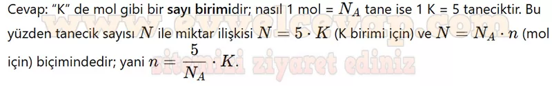
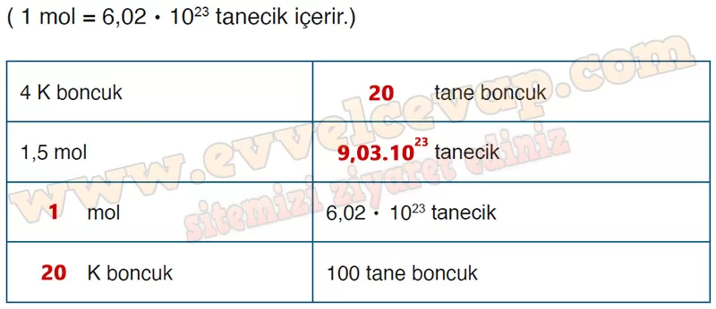

## 10. Sınıf Kimya Ders Kitabı Cevapları Meb Yayınları Sayfa 123

**Soru: 17) Bir kap kısaca “1 K” olarak isimlendirildiğine göre 1 K biriminin tanımını yaparak içerdiği tanecik sayısını yazınız.**

* **Cevap**: 1 K birimi 5 adet tanecik içeren madde miktarıdır.

**Soru: 18) Elde ettiğiniz işlemleri mol kavramı ile ilişkilendirerek açıklayınız.**

**Soru: 19) Elde ettiğiniz verilerden yola çıkarak aşağıdaki tabloyu tamamlayınız.**

**Soru: 20-22. soruları aşağıdaki tablo ve grafiğe göre cevaplayınız.**

Farklı mol sayılarında alınan suların kütlelerindeki değişim aşağıdaki tablo ve grafikte verilmiştir.

**Soru: 20) Su moleküllerinin kütlesi ile mol sayısı arasındaki ilişki nedir? Açıklayınız.**

* **Cevap**: Mol sayısı arttıkça kütle de artar. n= m/MA

**10. Sınıf Meb Yayınları Kimya Ders Kitabı Sayfa 123**