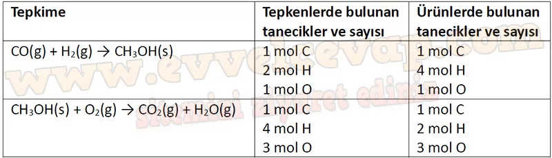

## 10. Sınıf Kimya Ders Kitabı Cevapları Meb Yayınları Sayfa 124

**Soru: 21) Tablodaki verilere dayanarak suyun mol kütlesinin doğru olup olmadığını nasıl test edersiniz? Açıklayınız.**

* **Cevap**: Her bir kütle değerine bu kütle değerini karşılık gelen mol sayısına bölündüğünde molekül kütlesi hesaplanmış olur.

**Soru: 22) Grafikteki bilgiler kullanılarak aşağıdakilerden hangisi çıkarılamaz?**

A) Mol kütlesi madde miktarından bağımsızdır.  
 B) Mol sayısı ile kütle arasında doğru orantı vardır.  
 C) 5 mol H20 bileşiğinde 90 g oksijen, 10 g hidrojen bulunur.  
 D) 36 g H20, 6 mol atom içerir.  
 E) 5 mol H20 bileşiğinde toplam 15 x 6,02 • 1023 tane atom bulunur.

**Soru: 23-26. sorulan aşağıdaki metne göre cevaplayınız.**

Metanol (CH3OH), ilk olarak odun talaşının damıtılmasıyla elde edilmiş en basit yapılı alkoldür. Odun talaşının damıtılmasından elde edildiği için metanole “odun ruhu” da denir. Artık metanol üretiminde CO ve H2 gazının belli şartlar altındaki tepkimesi kullanılmaktadır. Endüstride boya inceltici, makine sıvısı, antifriz, cam temizleyici gibi birçok kullanım alanı olan metanol, aynı zamanda bazı yarış arabalarında yakıt olarak kullanılmaktadır.

**Soru: 23) Verilen tepkimelerde tepken ve ürünlerin tanecik sayıları arasındaki tutarsızlığı belirlemek için aşağıdaki yöntemlerden hangisi kullanılamaz?**

A) Tepkimenin kütlenin korunumu kanununa uygunluğu sorgulanır.  
 B) Tepkenlerde ve ürünlerde bulunan her bir atom sayısı belirlenir.  
 C) Tepkenlerde ve ürünlerde bulunan her bir atom türü belirlenir.  
 D) Tepkenlerde ve ürünlerde bulunan her bir molekül türü belirlenir.  
 E) Tepkimeyi denkleştirmek için formüllerin önüne tam sayılar getirilir.

**Soru: 24) Verilen her bir tepkime için tepken ve ürünlerin tanecik sayıları arasındaki tutarsızlığı aşağıdaki tabloya yazarak belirleyiniz.**

**10. Sınıf Meb Yayınları Kimya Ders Kitabı Sayfa 124**