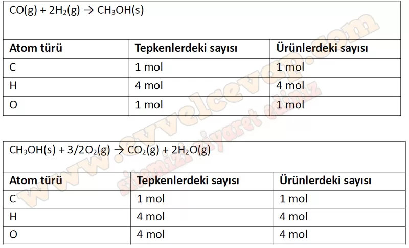

## 10. Sınıf Kimya Ders Kitabı Cevapları Meb Yayınları Sayfa 125

**Soru: 25) Tepkimelerde belirlediğiniz tutarsızlıkları gidermek için uygun katsayılar kullanarak verilen tepkimeleri denkleştiriniz.**

CO(g) + 2H2(g) → CH3OH(s)

CH3OH(s) + 3/2O2(g) → CO2(g) + 2H2O(g)

**Soru: 26) Denkleştirmiş olduğunuz tepkimelerdeki her bir atomun sayısını aşağıdaki tabloya yazınız. Tepkimenin denkliğini değerlendiriniz.**

**Soru: 27-30. sorulan aşağıdaki metne göre cevaplayınız.**

Altın, asitlere karşı dayanıklı ve korozyona uğramayan bir soy metaldir. Altın eldesinde farklı teknikler kullanılsa da bunlardan en yaygın olanı siyanürlü bileşik ile tepkimesidir. Bu teknikte altın cevheri ilk olarak sodyum siyanür (NaCN) bileşiği ile tepkimeye girerek altın iyonuna dönüşür ve çözeltiye geçer. Daha sonra çözeltiye çinko tozu ilave edilerek saf metalik altın elde edilir. Bu, oldukça etkili bir zenginleştirme yöntemi olsa da zehirli siyanür, su havzalarına ve toprağa karışarak insan sağlığına ve çevreye zarar verebilir.  
 Altın cevherinden altın saflaştırma basamakları aşağıdaki gibidir:

* **Cevap**: **Bu etkinliğin cevabı diğer sayfadadır. (Bkz. sayfa 126)**

**10. Sınıf Meb Yayınları Kimya Ders Kitabı Sayfa 125**