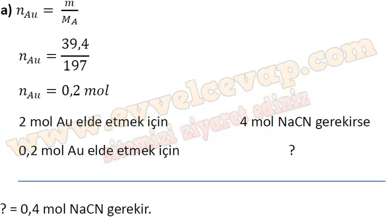
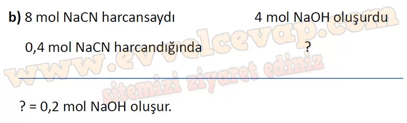
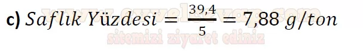
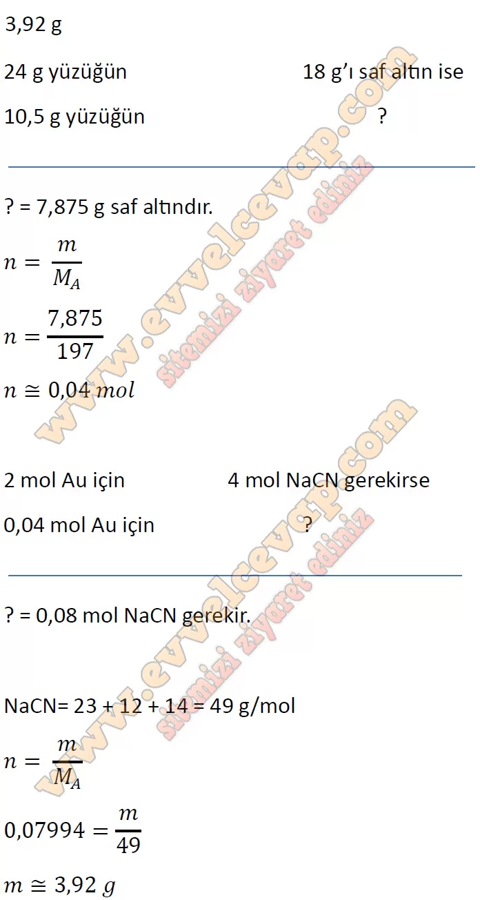

## 10. Sınıf Kimya Ders Kitabı Cevapları Meb Yayınları Sayfa 126

**Soru: 27) Denkleştirilmiş bu kimyasal tepkimelerde tepken ve ürünlerin katsayıları ile mol sayıları arasındaki aşağıda verilen ilişkilerden hangisi hatalıdır?**

A) 4 mol altın cevherinden 4 mol NaOH elde edilir.  
 B) 2 mol saf altın elde etmek için 2 mol çinko metali tepkimeye girer.  
 C) 8 mol NaCN ile 2 mol H20 tepkimeye girer.  
 D) 4 mol NaOH elde etmek için 1 mol 02kullanılır.  
 E) 2 mol Na[Au(CN)2] çözeltisi 1 mol çinko tozu ile tepkimeye girer.

**Soru: 28) Altın içeren bir cevherden 39,4 g altın elde etmek için tepkenler ve ürünler arasındaki stokiyometrik ilişkiyi gösteren bir zihin haritası oluşturunuz. (Au: 197 g/mol)**

* **Cevap**: Elde etmek istenilen altının mol sayısı hesaplanır. Bulunan altının mol sayısını elde edebilmek için kaç mol Na[Au(CN)2] kullanılması gerektiği bulunur. Bu bileşiği elde etmek için kaç mol altın cevheri kullanılması gerektiği hesaplanır.

**Soru: 29) Verilen denkleştirilmiş tepkime denklemlerinden yola çıkarak aşağıdaki soruları cevaplayınız,**

**Soru: a) Tepkimede kaç mol NaCN kullanılmıştır?**

**Soru: b) Tepkimede kaç mol NaOH oluşmuştur?**

**Soru: c) Tepkimede 5 ton altın cevheri kullanıldığına göre cehverin g/ton cinsinden saflık derecesi kaçtır? (Au: 197 g/mol)**

**Soru: 30) Kuyumculukta altının saflık değeri 24 ayar üzerinden değerlendirilir. Örneğin 24 ayar altın saf altındır. 18 ayar altın ise her 24 g’da 18 g saf altın, 6 g ise bakır gibi diğer madenleri içerir. Buna göre 18 ayar, 10,5 g altın yüzük elde etmek için yaklaşık kaç g NaCN kullanılmalıdır?**

**10. Sınıf Meb Yayınları Kimya Ders Kitabı Sayfa 126**