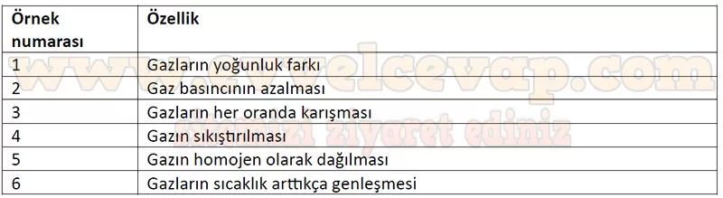

## 10. Sınıf Kimya Ders Kitabı Cevapları Meb Yayınları Sayfa 127

**Soru: 31-34. sorulan aşağıdaki posterden yararlanarak cevaplayınız.**

Bir öğrenci araştırma ödevi için gazların günlük hayatta kullanımı ile ilgili poster hazırlıyor.

Balonlarda kullanılan He gazı havadan daha hafiftir. Bu yüzden He gazı ile doldurulan balonlar yukarı doğru yükselir.  
 Gazlı içeceklerde C02 gazı kullanılır. İçeceğin kapağı açıldığında CÛ2 gazı içecekten dışarı çıkar ve kabarcıklar oluşur.  
 Dalgıçlar, derin dalışlarda normal hava ile doldurulmuş tüpler yerine oksijen oranı zenginleştirilmiş tüpleri tercih ederler.  
 Karbon dioksit içeren yangın tüpleri yüksek basınç altında doldurulur.  
 Bisiklet ve araba lastiklerine basınçlı hava pompalanır. Basınçlı hava lastiğin iç kısmına dağılarak düzgün bir sürüş sağlar.  
 Kamp yaparken kullanılan propan tüpleri yüksek sıcaklıkta patlama riski taşır.

**Soru: 31) Verilen bilgilerden yola çıkarak gazların özellikleriyle ilgili aşağıdaki ifadelerden hangisi yanlıştır?**

A) Gazlar yüksek basınç altında sıkıştırılabilir.  
 B) Otomobil lastiklerine basılan hava miktarı, lastiklerin basıncını belirler.  
 C) Gazların yoğunlukları kullanım alanlarında önemlidir.  
 D) Basınç ortadan kalktığında sıkışan gaz yayılır.  
 E) Elastik balonlar dış basınçtan etkilenmez.

**Soru: 32) Posterdeki örneklerden gazların özelliklerini belirleyerek aşağıdaki tabloya yazınız.**

**10. Sınıf Meb Yayınları Kimya Ders Kitabı Sayfa 127**